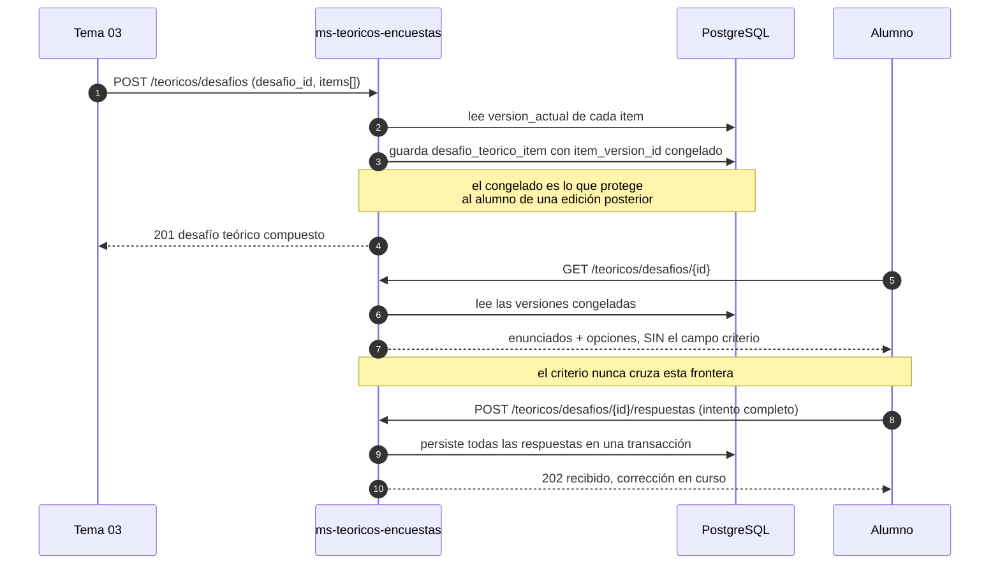
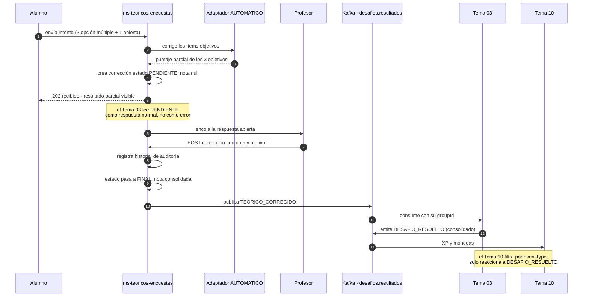
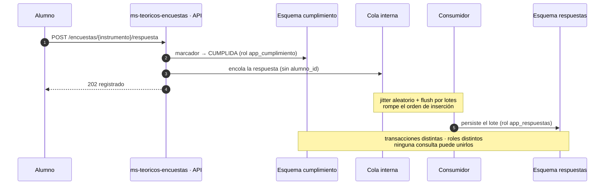

# [G04] — Teóricos y Encuestas
## Backlog del Sprint 1 · Épicas e Historias de Usuario

**Grupo 4** · Tema 04 · Programación IV — Back End
Servicio: `ms-teoricos-encuestas`
Stack: Spring Boot · Eureka · Spring Cloud Gateway · PostgreSQL · Flyway

---

## Cómo está armado este documento

Diez épicas (`G04-E01` … `G04-E10`) y cuarenta y seis historias con numeración corrida
(`G04-HU01` … `G04-HU46`), en el formato de la cátedra. Cada épica cierra con sus historias.

**Profundidad.** Veinte historias llevan el template completo —notas, CA numerados, tres
escenarios BDD, prototipo, estimación, dependencias y riesgos—. Son las que cargan el valor de
negocio o una garantía declarada: todo `G04-E07`, el núcleo de `G04-E05`, y las que sostienen
el anonimato, la no fuga del criterio de corrección, el umbral de publicación y la auditoría de
notas. Las otras veintiséis van en **formato breve**: descripción, criterios de aceptación,
estimación y dependencias. Son andamiaje de infraestructura y tareas de coordinación, donde tres
escenarios BDD serían ceremonia y no información. El criterio está declarado acá para que la
diferencia se lea como una decisión y no como una omisión.

**Trazabilidad.** Cada historia referencia el TO-DO del documento de diseño del que sale
(`A-nn` / `B-nn` / `C-nn`) y el requisito del PRD que la justifica. El diseño completo está en
`DISENIO-G04-SPRINT1.md`; los supuestos abiertos, en `PREGUNTAS-INTEGRACION-G04.md`.

| Marca | Significado |
|---|---|
| ★ | Historia con template completo |
| ▸ | Historia en formato breve |
| **Must / Should** | Prioridad MoSCoW. No hay *Won't* dentro del sprint: lo excluido está en la sección final |

---

## Suposiciones y restricciones que valen para todas las épicas

Se declaran una vez acá y cada épica solo agrega las suyas propias.

### Suposiciones transversales

| # | Suposición | Origen |
|---|---|---|
| S-01 | El archivado del curso **no** espera a las encuestas pendientes; el gate bloquea que el alumno vea su resultado, no que el profesor cierre el curso | D-07, pregunta 17b |
| S-02 | El Tema 03 acepta correcciones en estado `PENDIENTE` y nos informa el número de intento | Preguntas 4 y 5 |
| S-03 | El Tema 04 invoca al corrector por el gateway; el Tema 03 no actúa de conducto | Pregunta 2 |
| S-04 | La pertenencia a cohorte se consulta sincrónicamente al Tema 02 | Pregunta 16 |
| S-05 | No hay moderador disponible en el sprint: el stub aprueba todo tras feature flag | Pregunta 10, D-05 |
| S-06 | El bloqueo por encuesta pendiente lo aplica el front; el filtro de gateway queda documentado | Pregunta 25, D-06 |
| S-07 | La corrección semántica de respuestas abiertas no la toma el Tema 07 en el Sprint 1 | Pregunta 7 |
| S-08 | El bus de eventos es **Apache Kafka**, con envelope estándar obligatorio y tópicos por dominio funcional | Acuerdo de integración |
| S-09 | Publicamos `TEORICO_CORREGIDO` en `desafios.resultados`; **el Tema 03 lo consume, consolida y emite `DESAFIO_RESUELTO`**. Nosotros no le hablamos al Tema 10 | Acuerdo con el Tema 03 |
| S-10 | El Tema 10 y el Tema 11 **filtran por `eventType`** y reaccionan solo a `DESAFIO_RESUELTO`. Si escucharan el tópico entero sin filtrar, un mismo intento sumaría XP dos veces | A confirmar en la integración |
| S-11 | Los eventos de encuesta necesitan un tópico que hoy no existe. Se propone `encuestas.cumplimiento` | A confirmar en la integración |

### Restricciones

**Legales y normativas**

- **RF-NFR-10 / PAR-16** — a los cinco años el ADMIN puede desvincular al titular conservando el registro académico. Obliga a que todo `alumno_id` sea reemplazable por un subrogado irreversible.
- **RF-NFR-01** — prohibido el borrado físico. Toda entidad lleva baja lógica.
- **RF-ENC-12 / RSK-13** — ninguna consulta puede vincular a un alumno con el contenido de su respuesta de encuesta, ni exponer la lista nominal de quién cumplió.
- **PAR-18** — no se publican agregados de encuesta por debajo de cinco respuestas.

**Técnicas**

- **Un único microservicio, `ms-teoricos-encuestas`**, con dos módulos internos —`teoricos` y `encuestas`— sin dependencias cruzadas. Es la restricción del reparto de la cátedra: cada grupo entrega un servicio.
- Java 21 y Spring Boot 3.x; registro obligatorio en Eureka y exposición únicamente a través del gateway.
- **Apache Kafka como bus de eventos**, en Docker como infraestructura independiente. Lo sincrónico va por el gateway; lo asincrónico, por Kafka.
- **Envelope estándar obligatorio** en todo evento publicado: `eventId` (UUID), `eventType` (String), `timestamp` (ISO 8601 UTC), `producer` (String), `payload` (Object). Nuestro `producer` es `tema-04-teoricos-encuestas`.
- Los nombres de evento van en mayúscula con guion bajo: `TEORICO_CORREGIDO`, `ENCUESTA_CUMPLIDA`, `ENCUESTA_PERIODO_CERRADO`.
- PostgreSQL con migraciones versionadas en Flyway. Ninguna tabla se crea a mano ni por `ddl-auto`.
- **RF-NFR-07** — cero literales de usuario en el código: todo texto sale de una clave i18n.
- **D-12 / RF-NFR-06** — teóricos y encuestas son solo escritorio. En móvil se avisa explícitamente; no se degrada la vista.
- **Performance (supuesto propio del grupo, no heredado del PRD):** p95 por debajo de 500 ms en lecturas y de 1 s en escrituras, medido en el gateway con 50 usuarios concurrentes.

**Sobre la retención de Kafka y el derecho al olvido.** El evento `ENCUESTA_CUMPLIDA` lleva
`alumnoId`, y con razón: el marcador de cumplimiento es nominal por diseño. Pero Kafka **retiene
los mensajes**, así que el log del bus pasa a ser otro almacén de datos personales, y anonimizar
nuestra base a los cinco años (`G04-HU44`, RF-NFR-10) no borra lo que quedó publicado. O se
acuerda una política de retención por tópico, o se declara como residual conocido. Está anotado
para la sesión de integración porque probablemente le pase lo mismo a otros temas.

**Sobre el aislamiento dentro de un único servicio.** Con los dos módulos en el mismo proceso,
el anonimato ya no se puede apoyar en el despliegue: cualquiera puede inyectar el repositorio
equivocado y unir el marcador de cumplimiento con la respuesta anónima. Lo que antes era
imposible por topología ahora sería un descuido de dos líneas. Por eso el aislamiento baja un
nivel y pasa a ser **propiedad del motor de base de datos**: cuatro esquemas, cuatro roles de
PostgreSQL sin permisos cruzados y un origen de datos por rol, más un test de arquitectura que
prohíbe las dependencias entre módulos y ata cada repositorio a su origen de datos
(`G04-HU02`). El test de reconstrucción de `G04-HU08` sigue valiendo palabra por palabra: se
ejecuta con cada rol real y verifica que PostgreSQL rechaza el join por permisos.

**Sobre observabilidad y anonimato.** El criterio de aceptación de observabilidad se cumple en
las dos épicas de encuestas como **observabilidad sin correlación**: hay métricas agregadas
(contadores, latencias, tasa de error) y trazas de extremo a extremo en tiempo de ejecución,
pero el `trace_id` **no se persiste** junto a la respuesta y el body del `POST` de encuesta no
se escribe en ningún log. Instrumentar y correlacionar no son lo mismo, y acá se hace lo primero
sin lo segundo.

**Sobre regresiones.** El criterio «sin regresiones críticas» se declara **no aplicable en el
Sprint 1**: no existe una línea base previa contra la cual regresionar. A partir del Sprint 2 se
mide contra la suite de este sprint, que queda como línea base.

**Sobre accesibilidad.** Ambos servicios son backend puro: no renderizan interfaz, así que WCAG
no tiene sujeto directo. Lo que sí nos corresponde y se verifica en cada historia con salida al
usuario: (a) todo mensaje sale como **clave i18n** y no como literal, para que el front pueda
traducirlo y anunciarlo por lector de pantalla; (b) los errores de validación identifican **el
campo** que falló, para que el front pueda asociar el mensaje a su control; (c) el aviso de
escritorio de D-12 es una **respuesta explícita del backend**, no una degradación silenciosa.

---

# [G04-E01] — Cimientos del servicio

## Objetivo

Dejar `ms-teoricos-encuestas` levantado, descubrible en Eureka y reproducible en un comando,
con los dos módulos internos ya separados y esa separación verificada automáticamente. Es la
épica que permite que las otras nueve arranquen el mismo día en vez de en cascada.

Incluye el test de arquitectura, y no es un detalle de prolijidad: es lo que sustituye a la
barrera que antes daba el despliegue por separado.

## Suposiciones y Restricciones

**Suposiciones**
- El gateway y el servidor Eureka los provee la cátedra o el Tema 01; nosotros nos registramos, no los operamos.
- El servicio tiene una única base de datos, con cuatro esquemas y cuatro roles sin permisos cruzados.

**Restricciones**
- Un solo microservicio (D-13). Registro en Eureka obligatorio: no se expone por puerto directo (arquitectura de referencia del TP).
- Los módulos `teoricos` y `encuestas` no comparten ninguna entidad y no pueden importarse entre sí.
- Migraciones únicamente por Flyway; `spring.jpa.hibernate.ddl-auto` en `validate`.
- RF-NFR-07: cero literales de usuario. RF-NFR-06 y D-12: aviso explícito en móvil.

## Criterios de Aceptación a nivel Épico

- **Flujo extremo a extremo:** un integrante clona el repositorio, corre un comando y consulta `/actuator/health` a través del gateway obteniendo `UP`, con los cuatro esquemas migrados, sin configuración manual.
- **KPIs iniciales:** arranque en frío por debajo de 60 s; 0 dependencias cruzadas entre módulos; setup completo verificado por alguien que no escribió el compose en menos de 15 minutos.
- **Sin regresiones críticas:** no aplica — es el primer entregable del sistema y no hay línea base previa.
- **Observabilidad:** Actuator con `health`, `info` y `metrics` expuestos; logging estructurado en JSON con nivel configurable por entorno; correlación por `trace_id` habilitada en el módulo `teoricos` (en `encuestas` rige la restricción de observabilidad sin correlación).
- **Documentación:** README con requisitos, comando de arranque, variables de entorno y cómo verificar el registro en Eureka.

## Dependencias / Impactos

- **Servicios / APIs:** Eureka Server, Spring Cloud Gateway.
- **Módulos afectados:** ninguno preexistente — es fundacional.
- **Otros equipos:** Tema 01, si el gateway y el registro los opera ese grupo.
- **Impacto en datos / migraciones:** creación de la base y de sus cuatro esquemas, con migraciones separadas por esquema para que ninguna pueda declarar una clave foránea que los cruce.
- **Infraestructura:** el broker de Kafka corre en Docker como servicio independiente, compartido con el resto de la plataforma.
- **Feature toggles:** `desktop-only.enabled` (encendido por defecto). **Plan de retiro:** se retira si el PRD habilita móvil, lo que hoy la Tabla 9 descarta.

---

### ▸ [G04-HU01] — Servicio `ms-teoricos-encuestas` operativo y descubrible

**Como** equipo de desarrollo · **Quiero** el servicio levantado y registrado en Eureka · **Para** que los demás grupos puedan descubrirlo y consumirlo sin conocer su dirección.

**Notas**
- **Estructura:** dos módulos internos, `teoricos` y `encuestas`, con paquetes raíz separados desde el primer commit. Reorganizar paquetes después es barato; desenredar dependencias cruzadas, no.

**Criterios de Aceptación**
- **CA1:** `GET /actuator/health` devuelve 200 con `status: UP` y el servicio aparece en el registro de Eureka dentro de los 30 s de arrancado.
- **CA2:** Las migraciones de Flyway corren automáticamente al arrancar, separadas por esquema, y el arranque falla si una migración falla.
- **CA3:** La configuración de logging **no** incluye el body de las peticiones en ningún nivel, ni siquiera `DEBUG`.

**Estimación / Prioridad:** 5 puntos · **Must** · TO-DOs A-01, B-01, C-00
**Dependencias:** Eureka Server disponible. Sin dependencias internas.

---

### ▸ [G04-HU02] — Separación de módulos verificada por test de arquitectura

**Como** equipo de desarrollo · **Quiero** que las dependencias cruzadas entre los módulos estén prohibidas y verificadas automáticamente · **Para** que el aislamiento que antes daba el despliegue no dependa de que nadie se equivoque.

**Notas**
- **Por qué existe:** con los dos módulos en un mismo proceso, unir el marcador de cumplimiento con la respuesta anónima pasa a ser un descuido de dos líneas. El test es lo que lo vuelve a hacer imposible en la práctica.
- **Regla de negocio:** ninguna clase del módulo `encuestas` importa clases de `teoricos`, ni al revés. Lo compartido, si aparece, vive en un paquete común explícito y **nunca** incluye acceso a datos.

**Criterios de Aceptación**
- **CA1:** Un test de arquitectura falla si una clase de un módulo importa clases del otro.
- **CA2:** Un test verifica que cada repositorio usa el origen de datos que le corresponde y ninguno otro.
- **CA3:** Ambos tests corren en la integración continua y su falla bloquea el merge.

**Estimación / Prioridad:** 5 puntos · **Must** · TO-DO C-08
**Dependencias:** `G04-HU01`. Es la contraparte en código del aislamiento de base de `G04-HU06`.

---

### ▸ [G04-HU03] — Entorno local reproducible en un comando

**Como** integrante del equipo · **Quiero** levantar todo el entorno con un comando · **Para** no perder horas de sprint resolviendo diferencias de configuración entre máquinas.

**Criterios de Aceptación**
- **CA1:** `docker compose up` levanta Eureka, gateway, la base, **el broker de Kafka** y el servicio.
- **CA2:** El README documenta requisitos previos, variables de entorno y cómo verificar el registro.
- **CA3:** Un integrante que no escribió el compose lo levanta siguiendo solo el README, en menos de 15 minutos.

**Estimación / Prioridad:** 3 puntos · **Must** · TO-DO C-00
**Dependencias:** `G04-HU01`.

---

### ▸ [G04-HU04] — Externalización de textos con claves i18n

**Como** alumno que no habla español · **Quiero** que todo el texto que me llega salga de una clave traducible · **Para** poder usar la plataforma en mi idioma.

**Notas**
- **Regla de negocio:** el idioma se resuelve por la **preferencia del usuario** almacenada, no por el `Accept-Language` del navegador (RF-NFR-07).
- **Accesibilidad:** la clave i18n es lo que permite al front traducir y anunciar el mensaje; un literal embebido rompe esa cadena.

**Criterios de Aceptación**
- **CA1:** Ningún mensaje dirigido al usuario aparece como literal en el código: un test recorre los DTO y las excepciones y falla si encuentra uno.
- **CA2:** Toda respuesta de error incluye la clave i18n y el nombre del campo que la originó.
- **CA3:** Existe al menos un segundo archivo de idioma, aunque sea parcial, que demuestra que el mecanismo funciona sin tocar código.

**Estimación / Prioridad:** 5 puntos · **Must** · TO-DO C-06
**Dependencias:** `G04-HU01`. Impacta a **todas** las historias posteriores con salida al usuario.

---

### ▸ [G04-HU05] — Aviso explícito de que la sección requiere escritorio

**Como** alumno que abre un teórico desde el celular · **Quiero** un aviso claro de que necesito una computadora · **Para** no empezar un intento que no voy a poder terminar.

**Notas**
- **Regla de negocio:** D-12 y la Tabla 9 del PRD marcan teóricos y encuestas como no disponibles en móvil. RF-NFR-06 exige que el aviso sea explícito.
- **Decisión:** se responde con un código y una clave i18n; **no** se entrega una versión reducida de la vista.

**Criterios de Aceptación**
- **CA1:** Los endpoints de lectura de teórico y de encuesta devuelven código y clave i18n de «requiere escritorio» cuando el cliente es móvil.
- **CA2:** No existe una ruta que entregue contenido parcial a un cliente móvil.
- **CA3:** El comportamiento se controla por el flag `desktop-only.enabled` y está documentado su plan de retiro.

**Estimación / Prioridad:** 3 puntos · **Should** · TO-DO C-07
**Dependencias:** `G04-HU04` para las claves. Afecta a `G04-E04` y `G04-E07`.

---

# [G04-E02] — Aislamiento de datos para el anonimato

## Objetivo

Convertir la promesa de anonimato de las encuestas en una propiedad del motor de base de datos:
que ninguna consulta pueda vincular a un alumno con el contenido de su respuesta, y poder
demostrarlo con un test en vez de afirmarlo en un documento.

## Suposiciones y Restricciones

**Suposiciones**
- PostgreSQL 15 o superior, con soporte de `gen_random_uuid()` y de roles por esquema.
- El equipo acepta el costo operativo de administrar cuatro roles distintos y cuatro orígenes de datos dentro de una misma aplicación.

**Restricciones**
- **RF-ENC-12 y RSK-13:** ninguna consulta puede reconstruir el vínculo alumno–respuesta.
- **Criterio de release 15b:** la imposibilidad de reconstrucción debe estar probada, no declarada.
- **Residual aceptado y declarado:** con `curso + período`, un curso con un solo respondente lo identifica. Se mitiga con PAR-18 en `G04-E08`; es k-anonimato y se documenta como tal.

## Criterios de Aceptación a nivel Épico

- **Flujo extremo a extremo:** con el esquema desplegado, un intento de join entre `cumplimiento` y `respuestas` ejecutado con cualquiera de los dos roles de aplicación es rechazado por PostgreSQL por falta de permisos.
- **KPIs iniciales:** 5 de 5 canales de correlación cerrados y verificados por test automatizado; 0 claves foráneas entre esquemas.
- **Sin regresiones críticas:** no aplica en Sprint 1. A partir del Sprint 2, el test de reconstrucción es la línea base y su falla bloquea el merge.
- **Observabilidad:** **observabilidad sin correlación** — métricas agregadas de escritura y latencia sí; `trace_id` persistido y body en logs, no. Alerta configurada si aparece una migración que cree una FK entre esquemas.
- **Documentación:** los cinco canales y cómo se cierra cada uno, publicados junto al esquema; el residual de k-anonimato documentado explícitamente.

## Dependencias / Impactos

- **Servicios / APIs:** ninguno externo. Es interno al módulo `encuestas`.
- **Módulos afectados:** toda la persistencia del módulo `encuestas`; condiciona a `G04-E06`, `G04-E07` y `G04-E08`.
- **Otros equipos:** ninguno. Es la única épica del sprint sin dependencia externa, y por eso arranca primero.
- **Impacto en datos / migraciones:** creación de los esquemas `cumplimiento`, `catalogo` y `respuestas`, y de los roles `app_cumplimiento`, `app_catalogo` y `app_respuestas` con sus `GRANT`. Migración fundacional: nada que migrar hacia atrás.
- **Feature toggles:** **no**. Un aislamiento que se puede apagar con un flag no es un aislamiento.

---

### ★ [G04-HU06] — Esquemas y roles sin permisos cruzados

#### Descripción
- **Como:** responsable de privacidad del equipo
- **Quiero:** esquemas de base con roles de PostgreSQL sin permisos cruzados, y un origen de datos por rol
- **Para:** que el aislamiento entre quién cumplió y qué respondió lo imponga el motor y no la disciplina del equipo

#### Notas / Observaciones
- **Reglas de negocio:** `cumplimiento` guarda el marcador nominal; `respuestas` guarda el contenido anónimo; `catalogo` guarda la definición de la campaña, compartida y por eso no correlacionable. El `instrumento_id` identifica a la **campaña**, nunca a la encuesta individual de un alumno: si fuera individual, el join lo reconstruiría todo.
- **Validaciones:** ninguna migración puede crear una FK que cruce esquemas; se verifica en CI.
- **Datos obligatorios:** cuatro esquemas creados —`teoricos`, `cumplimiento`, `catalogo`, `respuestas`—; cuatro roles creados; `GRANT SELECT` sobre `catalogo` para los roles de cumplimiento y respuestas; ningún otro `GRANT` cruzado. El rol de `teoricos` no tiene permisos sobre ninguno de los tres esquemas de encuestas.
- **Performance:** sin impacto medible — el aislamiento es por permisos, no por consulta adicional.
- **Seguridad:** cada componente de la aplicación se conecta con **su** rol, a través de su propio origen de datos. Ningún componente usa el superusuario en tiempo de ejecución. Las credenciales van por variable de entorno, nunca en el repositorio. Como todo corre en un mismo proceso, que cada repositorio use el origen de datos correcto lo verifica el test de arquitectura de `G04-HU02`.
- **Accesibilidad:** no aplica — no hay salida al usuario.
- **Otros:** este es el trabajo que más conviene hacer primero de todo el sprint. Hecho tarde, obliga a re-auditar cada endpoint ya escrito.

#### Criterios de Aceptación
- **CA1:** Existen los esquemas `teoricos`, `cumplimiento`, `catalogo` y `respuestas`, creados por migraciones de Flyway separadas.
- **CA2:** El rol `app_cumplimiento` no tiene ningún permiso sobre `respuestas`, y `app_respuestas` no tiene ninguno sobre `cumplimiento`. Ambos tienen `SELECT` sobre `catalogo`.
- **CA3:** No existe ninguna clave foránea entre esquemas; una consulta que recorra el catálogo del sistema lo verifica y falla el build si aparece una.
- **Extras:** la aplicación arranca con un origen de datos por rol y ninguno configurado con superusuario.

#### BDD

**Característica:** aislamiento de datos de encuesta impuesto por el motor de base

**Escenario 1 — el join está prohibido, no vacío**
- **Dado** un marcador de cumplimiento y una respuesta de encuesta persistidos para la misma campaña
- **Cuando** se ejecuta una consulta que intenta unir `cumplimiento.marcador` con `respuestas.respuesta_encuesta` usando el rol `app_cumplimiento`
- **Entonces** PostgreSQL rechaza la consulta por falta de permisos sobre el esquema, y no devuelve un conjunto vacío

**Escenario 2 — el catálogo sí es legible desde ambos lados**
- **Dado** un instrumento publicado en el esquema `catalogo`
- **Cuando** el componente de cumplimiento y el de respuestas lo consultan, cada uno con su propio rol
- **Entonces** ambos obtienen la definición del instrumento correctamente

**Escenario 3 — una FK entre esquemas rompe el build**
- **Dado** el conjunto de migraciones vigente
- **Cuando** se agrega una migración que declara una clave foránea desde `respuestas` hacia `cumplimiento`
- **Entonces** la verificación de integridad del esquema falla y el build no pasa

#### Prototipo
- **Mock API / Swagger:** no aplica — la historia no expone endpoints.
- **Diagrama:** ver el diagrama de aislamiento incluido en `G04-E02`.
- **Figma / Storybook / capturas:** no aplica — servicio backend sin interfaz.

#### Estimación / Prioridad
| Puntos | Prioridad |
|---|---|
| 8 | Must |

#### Dependencias / Impactos
- **Servicios involucrados:** `ms-teoricos-encuestas`.
- **Módulos afectados:** toda la persistencia del servicio, en los dos módulos.
- **Otros equipos:** ninguno.
- **Impacto en datos / migraciones:** migración fundacional de esquemas y roles.
- **Riesgos y mitigación:** con todo en un mismo proceso, la comodidad de usar un solo origen de datos con superusuario «mientras tanto» anula el aislamiento sin que nadie lo note. **Mitigación:** el test del `CA3`, el test de arquitectura de `G04-HU02` que ata cada repositorio a su origen de datos, y una revisión explícita de la configuración de conexión en el code review de cada PR que toque persistencia.

---

### ▸ [G04-HU07] — Supresión de trazas y de body en logs

**Como** responsable de privacidad · **Quiero** que ni los logs ni las trazas persistan el vínculo · **Para** cerrar el canal de correlación más fácil de olvidar.

**Notas**
- **Seguridad:** el `trace_id` que genera el gateway sirve para depurar en tiempo de ejecución, pero **no** se guarda junto a la respuesta: persistido, es un identificador que enlaza los dos lados.

**Criterios de Aceptación**
- **CA1:** La tabla de respuestas no tiene ninguna columna que almacene `trace_id` ni identificador de petición.
- **CA2:** El body del `POST` de respuesta de encuesta no se escribe en ningún nivel de log, verificado por un test que inspecciona el appender.
- **CA3:** Las métricas agregadas de latencia y volumen siguen disponibles: se instrumenta sin correlacionar.

**Estimación / Prioridad:** 5 puntos · **Must** · TO-DO B-15
**Dependencias:** `G04-HU06`.

---

### ★ [G04-HU08] — Test de reconstrucción de los cinco canales

#### Descripción
- **Como:** equipo de desarrollo
- **Quiero:** un test que intente reconstruir el vínculo alumno–respuesta por los cinco canales conocidos y falle en los cinco
- **Para:** poder afirmar el anonimato con evidencia ejecutable en vez de con una promesa en un documento

#### Notas / Observaciones
- **Reglas de negocio:** los cinco canales son (1) join por clave, (2) correlación temporal, (3) orden de inserción, (4) secuencia de claves primarias y (5) logs y trazas. Cada uno tiene su cierre: esquemas y roles separados; ausencia de `created_at`; escritura encolada con jitter; `gen_random_uuid()`; supresión de trazas.
- **Validaciones:** el intento de join debe verificar que PostgreSQL **rechaza por permisos**. Un test que solo compruebe que el resultado viene vacío es un falso positivo: vacío también da una base mal poblada.
- **Datos obligatorios:** el test siembra al menos 30 respuestas de al menos dos campañas distintas, con marcadores correspondientes.
- **Performance:** el test corre en CI en menos de 2 minutos usando una base efímera en contenedor.
- **Seguridad:** el test se ejecuta con los roles reales de la aplicación, no con superusuario. Ejecutarlo con superusuario invalidaría el escenario 1.
- **Accesibilidad:** no aplica.
- **Otros:** es el entregable que materializa el criterio de release 15b. Si esta historia no está, la épica no cumplió su objetivo aunque el esquema esté bien.

#### Criterios de Aceptación
- **CA1:** El test cubre los cinco canales, con un caso por canal, y **afirma que cada intento falla**.
- **CA2:** El intento de join se ejecuta una vez con cada rol de aplicación y se verifica el rechazo por permisos, distinguiéndolo de un resultado vacío.
- **CA3:** El test corre en la integración continua y su falla bloquea el merge.
- **Extras:** un caso adicional documenta el residual de k-anonimato — `curso + período` con un único respondente — y lo enlaza con el umbral PAR-18 que lo mitiga en `G04-E08`.

#### BDD

**Característica:** verificación de que el vínculo alumno–respuesta no es reconstruible

**Escenario 1 — correlación temporal cerrada**
- **Dado** un conjunto de respuestas persistidas en momentos distintos y conocidos
- **Cuando** se intenta ordenarlas por su instante de creación para cruzarlas con el orden de los marcadores
- **Entonces** no existe ninguna columna de fecha y hora en la respuesta que permita ese ordenamiento, y el intento falla

**Escenario 2 — secuencia de claves cerrada**
- **Dado** cien respuestas insertadas de forma consecutiva
- **Cuando** se ordenan por su clave primaria buscando deducir el orden de llegada
- **Entonces** el orden resultante no guarda relación con el orden de inserción, porque las claves son UUID v4 y no contienen tiempo ni secuencia

**Escenario 3 — el residual queda declarado, no oculto**
- **Dado** un curso con una única respuesta en el período
- **Cuando** el test evalúa el escenario de k-anonimato
- **Entonces** el caso queda registrado como residual conocido y se verifica que el endpoint de KPI de `G04-E08` no publica el agregado por estar bajo el umbral de PAR-18

#### Prototipo
- **Mock API / Swagger:** no aplica.
- **Diagrama:** tabla de los cinco canales y su cierre, publicada junto al esquema.
- **Figma / Storybook / capturas:** no aplica — servicio backend sin interfaz.

#### Estimación / Prioridad
| Puntos | Prioridad |
|---|---|
| 8 | Must |

#### Dependencias / Impactos
- **Servicios involucrados:** `ms-teoricos-encuestas` (módulo `encuestas`).
- **Módulos afectados:** persistencia, logging y la integración continua.
- **Otros equipos:** ninguno, aunque el resultado es material de presentación para la cátedra y para la sesión de integración.
- **Impacto en datos / migraciones:** ninguno — el test solo lee y siembra datos efímeros.
- **Riesgos y mitigación:** el escenario 3 de `G04-HU08` depende de `G04-E08`, que se implementa después. **Mitigación:** el caso se escribe con el umbral parametrizado y se activa cuando `G04-HU36` esté disponible; hasta entonces queda marcado como pendiente explícito, no comentado.

---
### ▸ [G04-HU09] — Declaración documentada del residual de k-anonimato

**Como** auditor o docente que revisa el diseño · **Quiero** que el límite conocido del anonimato esté escrito · **Para** que se descubra en la documentación y no en producción.

**Notas**
- **Regla de negocio:** con `curso + período`, un curso donde respondió una sola persona la identifica. Es k-anonimato y no se puede eliminar sin destruir el KPI-02, que es por curso.
- **Mitigación asociada:** umbral PAR-18 en `G04-E08` y publicación recién al cierre del período.

**Criterios de Aceptación**
- **CA1:** El residual está documentado junto al esquema, con su mitigación enlazada.
- **CA2:** El caso está representado en el test de `G04-HU08` y no solo en prosa.
- **CA3:** La documentación indica explícitamente que la mitigación es un umbral y no una eliminación del riesgo.

**Estimación / Prioridad:** 2 puntos · **Should** · TO-DO B-16
**Dependencias:** `G04-HU08`. Se cierra junto con `G04-HU36`.

---

# [G04-E03] — Banco de ítems versionado

## Objetivo

Darle al profesor una colección reutilizable de preguntas con identidad estable y contenido
inmutable, para que pueda corregir o mejorar un ítem sin invalidar lo que los alumnos ya
respondieron.

## Suposiciones y Restricciones

**Suposiciones**
- El profesor es dueño de su banco: no hay banco compartido entre docentes en el Sprint 1.
- El Tema 01 provee la identidad del profesor en el token; nosotros la validamos, no la emitimos.

**Restricciones**
- **D-04 y RF-CUR-05:** un ítem ya respondido es inmutable; editar crea una versión nueva. Mismo criterio que `rubric_version` en RF-IA-13.
- **RF-NFR-01:** baja lógica, nunca borrado físico.
- **D-09:** conversación y debate estructurado quedan fuera del Sprint 1.
- El `criterio` de corrección es dato sensible: no puede viajar en ninguna respuesta consumida por un alumno.

## Criterios de Aceptación a nivel Épico

- **Flujo extremo a extremo:** un profesor da de alta ítems de los cinco tipos habilitados, los lista filtrando por tipo, edita uno y comprueba que la versión anterior sigue intacta.
- **KPIs iniciales:** los 5 tipos habilitados aceptan alta y validación; 0 casos de mutación de una versión ya respondida; p95 del listado del banco por debajo de 500 ms con 500 ítems.
- **Sin regresiones críticas:** no aplica en Sprint 1.
- **Observabilidad:** contador de altas por tipo de ítem y de intentos de mutación rechazados; log de auditoría en cada creación de versión.
- **Documentación:** el esquema de `payload` y `criterio` de cada tipo, publicado junto al OpenAPI, para que el Tema 03 y el front sepan qué esperar.

## Dependencias / Impactos

- **Servicios / APIs:** Tema 01 para la identidad del profesor.
- **Módulos afectados:** fundacional dentro del módulo `teoricos`; condiciona a `G04-E04` y `G04-E05`.
- **Otros equipos:** Tema 03, que consumirá los ítems al componer desafíos.
- **Impacto en datos / migraciones:** creación de `item` e `item_version`. Sin datos previos que migrar.
- **Feature toggles:** **no**. Los tipos diferidos se controlan por validación del enum, que es una regla de negocio explícita y no un interruptor.

---

### ★ [G04-HU10] — Ítems con identidad estable y contenido versionado

#### Descripción
- **Como:** profesor
- **Quiero:** que mis ítems tengan una identidad estable y un contenido versionado
- **Para:** poder corregir el enunciado de una pregunta sin invalidar ni alterar lo que los alumnos ya respondieron

#### Notas / Observaciones
- **Reglas de negocio:** `item` guarda la identidad, el dueño y el tipo; `item_version` guarda el enunciado, el `payload` y el `criterio`, y es **inmutable** una vez que existe al menos una respuesta contra ella. Editar un ítem crea una versión nueva e incrementa `version_actual`; las versiones anteriores no se tocan.
- **Validaciones:** el tipo del ítem no se puede cambiar entre versiones — cambiar de opción múltiple a respuesta abierta es un ítem distinto, no una versión.
- **Datos obligatorios:** `profesor_id`, `tipo`, `enunciado`, `payload`. El `criterio` es obligatorio en los cuatro tipos autocorregibles y opcional en respuesta abierta.
- **Performance:** el alta de una versión es una única transacción; p95 por debajo de 1 s.
- **Seguridad:** solo el profesor dueño puede crear versiones de su ítem. El `criterio` nunca se expone fuera del contexto del profesor o del corrector.
- **Accesibilidad:** los mensajes de validación identifican el campo y salen como clave i18n.
- **Otros:** esta decisión es la que habilita la analítica de dificultad por ítem del backlog posterior. Si los ítems se hubieran duplicado dentro de cada desafío, esa métrica sería imposible.

#### Criterios de Aceptación
- **CA1:** Editar un ítem crea una `item_version` nueva y deja intactas las anteriores, verificable comparando el contenido antes y después.
- **CA2:** Un intento de modificar una `item_version` que ya tiene respuestas asociadas es rechazado con un error explícito.
- **CA3:** `version_actual` del ítem apunta siempre a la última versión creada.
- **Extras:** el tipo de un ítem es inmutable entre versiones.

#### BDD

**Característica:** versionado inmutable de ítems del banco

**Escenario 1 — editar no destruye la versión anterior**
- **Dado** un ítem con una versión 1 ya respondida por un alumno
- **Cuando** el profesor edita el enunciado del ítem
- **Entonces** se crea una versión 2 con el texto nuevo, la versión 1 conserva su texto original y la respuesta del alumno sigue apuntando a la versión 1

**Escenario 2 — la versión respondida no se puede mutar**
- **Dado** una `item_version` con al menos una respuesta asociada
- **Cuando** se intenta modificarla directamente
- **Entonces** la operación es rechazada y el contenido permanece idéntico

**Escenario 3 — el tipo no cambia entre versiones**
- **Dado** un ítem de tipo opción múltiple
- **Cuando** el profesor intenta editarlo cambiando su tipo a respuesta abierta
- **Entonces** la operación es rechazada con un mensaje que indica que debe crear un ítem nuevo

#### Prototipo
- **Mock API / Swagger:** `POST /teoricos/items`, `PUT /teoricos/items/{id}`.
- **Diagrama:** diagrama de secuencia de composición y congelado, en `G04-E04`.
- **Figma / Storybook / capturas:** no aplica — servicio backend sin interfaz.

#### Estimación / Prioridad
| Puntos | Prioridad |
|---|---|
| 8 | Must |

#### Dependencias / Impactos
- **Servicios involucrados:** `ms-teoricos-encuestas` (módulo `teoricos`); Tema 01 para la identidad del profesor.
- **Módulos afectados:** modelo de dominio de teóricos; condiciona a `G04-E04` y `G04-E05`.
- **Otros equipos:** Tema 03 como consumidor.
- **Impacto en datos / migraciones:** creación de `item` e `item_version`.
- **Riesgos y mitigación:** el atajo de actualizar la fila en lugar de crear una versión es tentador y silencioso. **Mitigación:** el `CA2` como test automatizado y la ausencia de cualquier método de actualización sobre `item_version` en el repositorio.

---

### ▸ [G04-HU11] — ABM del banco de ítems con baja lógica

**Como** profesor · **Quiero** dar de alta, listar, editar y dar de baja ítems de mi banco · **Para** reutilizar preguntas entre cursos y períodos sin volver a escribirlas.

**Notas**
- **Seguridad:** el listado devuelve únicamente los ítems del profesor autenticado (RF-USR-07/08).
- **Regla de negocio:** la baja es lógica; un ítem dado de baja no aparece en el banco pero sigue siendo legible desde los desafíos que lo usaron (RF-NFR-01).

**Criterios de Aceptación**
- **CA1:** `POST`, `GET` y `PUT` sobre `/teoricos/items` funcionan y el `GET` es filtrable por tipo.
- **CA2:** La baja marca la fecha de baja lógica y no ejecuta ningún `DELETE` físico.
- **CA3:** Un profesor que solicita el banco de otro profesor recibe un conjunto vacío o un 403, nunca ítems ajenos.

**Estimación / Prioridad:** 5 puntos · **Must** · TO-DO A-03
**Dependencias:** `G04-HU10`.

---

### ★ [G04-HU12] — Los cuatro tipos autocorregibles con su clave de corrección

#### Descripción
- **Como:** profesor
- **Quiero:** cargar ítems de opción múltiple, verdadero/falso, emparejar conceptos y ordenar secuencias con su clave de corrección
- **Para:** que el sistema los corrija solo y el alumno tenga su nota sin esperarme

#### Notas / Observaciones
- **Reglas de negocio:** los cuatro tipos tienen formas incompatibles entre sí, por eso `payload` y `criterio` son `jsonb` y cada tipo tiene su propio validador. Opción múltiple lleva opciones y una o varias correctas; verdadero/falso lleva la afirmación y el valor esperado; emparejar lleva dos columnas y el conjunto de pares correctos; ordenar lleva los elementos y la secuencia esperada.
- **Validaciones:** opción múltiple exige al menos dos opciones y al menos una correcta; emparejar exige que cada par referencie elementos existentes; ordenar exige que la secuencia esperada contenga todos los elementos exactamente una vez.
- **Datos obligatorios:** `tipo`, `enunciado`, `payload` completo según el tipo, `criterio` completo según el tipo.
- **Performance:** la validación es en memoria; p95 por debajo de 300 ms.
- **Seguridad:** el `criterio` es la clave de corrección. Se persiste en la misma fila pero **nunca** se serializa en una respuesta consumida por un alumno — ver `G04-HU15`.
- **Accesibilidad:** un `payload` mal armado devuelve el campo exacto que falló, con clave i18n, para que el front lo señale sobre el control correspondiente.
- **Otros:** siete tablas con columnas nulas, una por tipo, sería peor y cerraría la puerta a los tipos futuros. El `jsonb` los admite sin migración.

#### Criterios de Aceptación
- **CA1:** Los cuatro tipos aceptan alta con su `payload` y su `criterio` bien formados.
- **CA2:** Cada tipo rechaza un `payload` mal armado con un mensaje que identifica el campo problemático.
- **CA3:** Un ítem de opción múltiple sin ninguna opción marcada como correcta es rechazado.
- **Extras:** un ítem de ordenar cuya secuencia esperada repita o se saltee un elemento es rechazado.

#### BDD

**Característica:** carga y validación de los tipos de ítem autocorregibles

**Escenario 1 — alta válida de opción múltiple**
- **Dado** un profesor autenticado
- **Cuando** da de alta un ítem de opción múltiple con cuatro opciones y una marcada como correcta
- **Entonces** el ítem se crea con su versión 1 y queda disponible en su banco

**Escenario 2 — emparejar con un par huérfano**
- **Dado** un ítem de emparejar cuyo conjunto de pares referencia un concepto que no está en las columnas
- **Cuando** el profesor intenta darlo de alta
- **Entonces** la operación es rechazada indicando el par inválido, y no se crea ninguna versión

**Escenario 3 — ordenar con secuencia incompleta**
- **Dado** un ítem de ordenar con cinco elementos y una secuencia esperada de cuatro
- **Cuando** el profesor intenta darlo de alta
- **Entonces** la operación es rechazada indicando que la secuencia debe contener todos los elementos exactamente una vez

#### Prototipo
- **Mock API / Swagger:** `POST /teoricos/items` con un ejemplo de `payload` y `criterio` por tipo, publicado en el OpenAPI.
- **Figma / Storybook / capturas:** no aplica — servicio backend sin interfaz.

#### Estimación / Prioridad
| Puntos | Prioridad |
|---|---|
| 8 | Must |

#### Dependencias / Impactos
- **Servicios involucrados:** `ms-teoricos-encuestas` (módulo `teoricos`).
- **Módulos afectados:** modelo de ítems; es insumo directo del corrector automático de `G04-HU18`.
- **Otros equipos:** el front necesita el esquema de cada `payload` para renderizar la pregunta.
- **Impacto en datos / migraciones:** ninguno adicional a `G04-HU10`.
- **Riesgos y mitigación:** un `jsonb` sin validación estricta degenera en datos inconsistentes que rompen el corrector en tiempo de ejecución. **Mitigación:** validador obligatorio por tipo, con test de caso feliz y de caso inválido para cada uno de los cuatro.

---

### ▸ [G04-HU13] — Ítems de respuesta abierta y rechazo explícito de los tipos diferidos

**Como** profesor · **Quiero** cargar ítems de respuesta abierta · **Para** evaluar comprensión y no solo memoria.

**Notas**
- **Regla de negocio:** la respuesta abierta se marca como de corrección humana y entra en la cola del profesor (D-01).
- **D-09:** conversación y debate estructurado existen en el enum pero se rechazan al crearse. No encajan en el modelo de «responder n ítems y enviar»: uno es multi-turno y el otro involucra a terceros en simultáneo, y faltan decisiones de producto que todavía no existen.

**Criterios de Aceptación**
- **CA1:** Un ítem de respuesta abierta se crea con enunciado y consigna, y queda marcado como de corrección humana.
- **CA2:** Un intento de crear un ítem de tipo conversación o debate es rechazado con un mensaje que dice que está diferido, no con un error genérico.
- **CA3:** El `criterio` es opcional en respuesta abierta y, si está presente, sirve de guía para el corrector humano.

**Estimación / Prioridad:** 3 puntos · **Must** · TO-DO A-05
**Dependencias:** `G04-HU10`.

---
# [G04-E04] — Composición y entrega del desafío teórico

## Objetivo

Permitir que el Tema 03 componga la parte teórica de un desafío con ítems del banco, y que el
alumno la lea y la responda, con dos garantías: la versión del ítem queda congelada al publicar
y la clave de corrección nunca sale hacia el alumno.

## Suposiciones y Restricciones

**Suposiciones**
- El Tema 03 es dueño del ciclo de vida del desafío —estados, fechas, versionado, entrega— y nos entrega un `desafio_id` ya creado (S-02, S-03).
- El número de intento lo informa el Tema 03 en el request; nosotros no lo calculamos.

**Restricciones**
- **D-04:** al publicar se congela la `item_version_id`. Un ítem editado después no altera un desafío ya publicado.
- El campo `criterio` **no** puede aparecer en ninguna respuesta consumida por un alumno.
- **RF-REC-04/06:** el desafío de recuperación de vida se reintenta sin tope. El límite de RF-DES-07 no le aplica.
- **D-12:** solo escritorio.

## Criterios de Aceptación a nivel Épico

- **Flujo extremo a extremo:** el Tema 03 compone un desafío teórico, el alumno lo lee, responde su intento completo y las respuestas quedan persistidas contra las versiones congeladas.
- **KPIs iniciales:** 0 apariciones del campo `criterio` en respuestas destinadas al alumno, verificado por test; p95 de la lectura del desafío por debajo de 500 ms; 100 % de las respuestas de un intento persistidas atómicamente.
- **Sin regresiones críticas:** no aplica en Sprint 1.
- **Observabilidad:** contador de intentos iniciados y enviados, latencia de la entrega y alerta si aparece una respuesta huérfana sin desafío asociado.
- **Documentación:** OpenAPI de los tres endpoints, con el ejemplo explícito de la respuesta que ve el alumno —sin `criterio`— para que el front no espere un campo que nunca va a llegar.

## Dependencias / Impactos

- **Servicios / APIs:** Tema 03 (composición y número de intento), Tema 01 (identidad del alumno), gateway.
- **Módulos afectados:** modelo de ítems de `G04-E03`; alimenta al motor de corrección de `G04-E05`.
- **Otros equipos:** **Tema 03 es dependencia dura y bidireccional.** Cualquier cambio en el contrato hay que acordarlo con ellos.
- **Impacto en datos / migraciones:** creación de `desafio_teorico`, `desafio_teorico_item` y `respuesta`.
- **Feature toggles:** `desktop-only.enabled`, compartido con `G04-E01`.

### Diagrama de secuencia — composición, congelado y entrega

---

### ▸ [G04-HU14] — Composición del desafío teórico con congelado de versión

**Como** Tema 03 · **Quiero** componer un desafío teórico eligiendo ítems del banco · **Para** que el alumno tenga contenido que responder dentro del desafío que yo administro.

**Notas**
- **Regla de negocio:** al componer se guarda la `item_version_id` vigente, no el `item_id`. Es el congelado de D-04.
- **Datos obligatorios:** `desafio_id`, `curso_cohorte_id`, lista de ítems con orden y puntaje.

**Criterios de Aceptación**
- **CA1:** `POST /teoricos/desafios` compone el desafío y guarda por ítem su versión congelada, su orden y su puntaje.
- **CA2:** Editar un ítem del banco después de componer no altera el desafío ya compuesto.
- **CA3:** La suma de los puntajes de los ítems se valida y se expone, para que el Tema 03 pueda mostrarla.

**Estimación / Prioridad:** 5 puntos · **Must** · TO-DO A-06
**Dependencias:** `G04-HU11`. Dependencia dura con el Tema 03.

---

### ★ [G04-HU15] — Lectura del desafío por el alumno sin la clave de corrección

#### Descripción
- **Como:** alumno
- **Quiero:** ver los enunciados y las opciones de mi desafío teórico
- **Para:** poder resolverlo

#### Notas / Observaciones
- **Reglas de negocio:** se devuelven los ítems en el orden definido al componer, con su puntaje visible, tomados de la versión congelada.
- **Validaciones:** el alumno debe pertenecer a la cohorte del desafío; si no, 403. La pertenencia se consulta al Tema 02 (S-04).
- **Datos obligatorios en la respuesta:** identificador de la versión del ítem, tipo, enunciado, `payload` de presentación, orden y puntaje.
- **Performance:** p95 por debajo de 500 ms con un desafío de 30 ítems.
- **Seguridad:** **el campo `criterio` no se serializa en ninguna rama del JSON.** Es la clave de corrección: filtrarla convierte cualquier teórico en un examen con las respuestas al dorso. Se verifica con un test que serializa la respuesta completa y afirma que la clave no aparece en ningún nivel de anidamiento.
- **Accesibilidad:** si el cliente es móvil, se responde con el aviso explícito de `G04-HU05` y no con una vista reducida.
- **Otros:** el `payload` de presentación es un subconjunto del `payload` almacenado: para emparejar, por ejemplo, se envían las dos columnas pero no el conjunto de pares correctos.

#### Criterios de Aceptación
- **CA1:** `GET /teoricos/desafios/{id}` devuelve los ítems con enunciado, opciones, orden y puntaje.
- **CA2:** El campo `criterio` no aparece en ninguna parte de la respuesta, verificado sobre el JSON serializado completo.
- **CA3:** Un alumno que no pertenece a la cohorte del desafío recibe 403 y ningún contenido.
- **Extras:** un cliente móvil recibe el aviso de escritorio y ningún enunciado.

#### BDD

**Característica:** entrega del desafío teórico al alumno

**Escenario 1 — la clave de corrección no viaja**
- **Dado** un desafío teórico compuesto con ítems de opción múltiple y de emparejar
- **Cuando** un alumno de la cohorte solicita el desafío
- **Entonces** recibe los enunciados y las opciones, y el JSON devuelto no contiene el campo `criterio` en ningún nivel

**Escenario 2 — la edición posterior no altera lo entregado**
- **Dado** un desafío compuesto con la versión 1 de un ítem, y que el profesor creó después una versión 2 con otro enunciado
- **Cuando** el alumno solicita el desafío
- **Entonces** recibe el enunciado de la versión 1, que es la congelada al componer

**Escenario 3 — alumno ajeno a la cohorte**
- **Dado** un alumno que no pertenece a la cohorte del desafío
- **Cuando** solicita el desafío
- **Entonces** recibe 403 y ningún enunciado, ni siquiera parcial

#### Prototipo
- **Mock API / Swagger:** `GET /teoricos/desafios/{id}`, con ejemplo de respuesta que muestra explícitamente la ausencia del campo `criterio`.
- **Diagrama:** diagrama de secuencia de `G04-E04`, tramo de entrega.
- **Figma / Storybook / capturas:** no aplica — servicio backend sin interfaz.

#### Estimación / Prioridad
| Puntos | Prioridad |
|---|---|
| 5 | Must |

#### Dependencias / Impactos
- **Servicios involucrados:** `ms-teoricos-encuestas` (módulo `teoricos`), Tema 02 para pertenencia a cohorte, Tema 01 para identidad.
- **Módulos afectados:** capa de serialización y de autorización de teóricos.
- **Otros equipos:** el front consume esta respuesta para renderizar el desafío.
- **Impacto en datos / migraciones:** ninguno — es solo lectura.
- **Riesgos y mitigación:** la fuga del `criterio` puede aparecer por un DTO nuevo, por un `@JsonInclude` mal puesto o por devolver la entidad directamente. **Mitigación:** el test del `CA2` corre sobre la respuesta HTTP serializada, no sobre el DTO, para que detecte la fuga venga por donde venga.

---

### ★ [G04-HU16] — Envío del intento completo

#### Descripción
- **Como:** alumno
- **Quiero:** enviar todas mis respuestas de una sola vez
- **Para:** no perder lo resuelto si algo falla a mitad de camino

#### Notas / Observaciones
- **Reglas de negocio:** un intento se envía completo. Los ítems no respondidos se persisten como respuesta vacía, no se omiten: la diferencia importa para la corrección y para la analítica de dificultad.
- **Validaciones:** todas las `item_version_id` recibidas deben pertenecer al desafío; el intento debe venir informado por el Tema 03; no se aceptan respuestas para un desafío cerrado.
- **Datos obligatorios:** `desafio_id`, `alumno_id`, `intento`, lista de respuestas con `item_version_id` y `contenido`.
- **Performance:** persistencia atómica de hasta 30 respuestas en una transacción; p95 por debajo de 1 s.
- **Seguridad:** el alumno solo puede enviar respuestas a nombre propio. El `alumno_id` se toma del token, nunca del body.
- **Accesibilidad:** los errores de validación identifican el ítem exacto que falló, para que el front pueda llevar el foco hasta él.
- **Otros:** el envío dispara la corrección automática de los tipos objetivos y encola los abiertos para el profesor.

#### Criterios de Aceptación
- **CA1:** `POST /teoricos/desafios/{id}/respuestas` recibe todas las respuestas del intento y las persiste en una sola transacción.
- **CA2:** Si una sola respuesta es inválida, no se persiste ninguna y se informa cuál falló.
- **CA3:** El `alumno_id` se resuelve desde el token; un `alumno_id` en el body se ignora o se rechaza.
- **Extras:** los ítems dejados en blanco se persisten como respuesta vacía y no como ausencia de fila.

#### BDD

**Característica:** recepción del intento de un desafío teórico

**Escenario 1 — envío completo y atómico**
- **Dado** un alumno con un desafío teórico de cinco ítems asignado
- **Cuando** envía las cinco respuestas en un único request
- **Entonces** las cinco quedan persistidas contra las versiones congeladas y se dispara la corrección

**Escenario 2 — una respuesta inválida cancela el envío entero**
- **Dado** un intento con cuatro respuestas válidas y una que referencia una versión de ítem ajena al desafío
- **Cuando** el alumno lo envía
- **Entonces** no se persiste ninguna respuesta y el error indica cuál fue el ítem inválido

**Escenario 3 — suplantación rechazada**
- **Dado** un alumno autenticado que incluye en el body el identificador de otro alumno
- **Cuando** envía el intento
- **Entonces** las respuestas se persisten a nombre del alumno del token, o la petición se rechaza; en ningún caso quedan a nombre del otro alumno

#### Prototipo
- **Mock API / Swagger:** `POST /teoricos/desafios/{id}/respuestas`.
- **Diagrama:** diagrama de secuencia de `G04-E04`, tramo de envío.
- **Figma / Storybook / capturas:** no aplica — servicio backend sin interfaz.

#### Estimación / Prioridad
| Puntos | Prioridad |
|---|---|
| 5 | Must |

#### Dependencias / Impactos
- **Servicios involucrados:** `ms-teoricos-encuestas` (módulo `teoricos`), Tema 03 (número de intento), Tema 01 (identidad).
- **Módulos afectados:** persistencia de respuestas; es la entrada del motor de corrección.
- **Otros equipos:** Tema 03.
- **Impacto en datos / migraciones:** creación de la tabla `respuesta`.
- **Riesgos y mitigación:** si el Tema 03 no nos informa el intento, no podemos distinguir un reenvío de un reintento. **Mitigación:** es el supuesto S-02 y está en la lista de la sesión de integración; hasta confirmarlo, el campo es obligatorio en el contrato y su ausencia devuelve 400.

---

### ★ [G04-HU17] — Reintento sin tope para el desafío de recuperación de vida

#### Descripción
- **Como:** alumno que perdió una vida
- **Quiero:** poder reintentar el desafío de recuperación las veces que haga falta
- **Para:** recuperar mi vida y seguir cursando sin quedarme trabado

#### Notas / Observaciones
- **Reglas de negocio:** RF-REC-04 y RF-REC-06 describen un desafío de recuperación reintentable de forma indefinida. **El límite de intentos de RF-DES-07 no le aplica.** Si modeláramos `intento` con un máximo de 4, ese tipo de desafío rompería el modelo entero.
- **Validaciones:** `intento` es un entero positivo sin cota superior en el modelo ni en la validación.
- **Datos obligatorios:** `intento`, informado por el Tema 03.
- **Performance:** cada reintento persiste su propio conjunto de respuestas; el crecimiento es lineal y aceptable.
- **Seguridad:** los intentos anteriores de un alumno son visibles solo para él y para el profesor del curso.
- **Accesibilidad:** no aplica directamente.
- **Otros:** quién decide si un desafío es de recuperación es el Tema 03. Nosotros no imponemos el límite, y ese es exactamente el punto de la historia.

#### Criterios de Aceptación
- **CA1:** El campo `intento` no tiene máximo en el modelo de datos ni en la validación de entrada.
- **CA2:** Diez intentos consecutivos del mismo alumno sobre el mismo desafío se persisten los diez, cada uno con su corrección independiente.
- **CA3:** La corrección de un intento no sobrescribe ni invalida la de los anteriores.

#### BDD

**Característica:** reintentos sin límite en el desafío de recuperación de vida

**Escenario 1 — décimo reintento aceptado**
- **Dado** un alumno que ya realizó nueve intentos del desafío de recuperación
- **Cuando** envía el décimo intento
- **Entonces** el intento se persiste normalmente y se corrige como cualquier otro

**Escenario 2 — el historial se conserva**
- **Dado** un alumno con tres intentos corregidos con notas distintas
- **Cuando** se consultan sus correcciones para ese desafío
- **Entonces** aparecen las tres, cada una con su número de intento y su nota

**Escenario 3 — cada intento tiene su propia corrección**
- **Dado** un alumno que desaprobó el intento 1 y aprobó el intento 2
- **Cuando** se consulta el resultado del intento 1
- **Entonces** sigue figurando como desaprobado, sin haber sido alterado por el intento posterior

#### Prototipo
- **Mock API / Swagger:** `POST /teoricos/desafios/{id}/respuestas` con el campo `intento`; `GET /teoricos/correcciones/{desafio}/{alumno}`.
- **Figma / Storybook / capturas:** no aplica — servicio backend sin interfaz.

#### Estimación / Prioridad
| Puntos | Prioridad |
|---|---|
| 3 | Must |

#### Dependencias / Impactos
- **Servicios involucrados:** `ms-teoricos-encuestas` (módulo `teoricos`), Tema 03.
- **Módulos afectados:** modelo de respuestas y de correcciones.
- **Otros equipos:** el Tema 03 define qué desafío es de recuperación y consolida el resultado; el Tema 10 devuelve la vida al recibir el `DESAFIO_RESUELTO`.
- **Impacto en datos / migraciones:** ninguno adicional.
- **Riesgos y mitigación:** un límite de intentos agregado «por prolijidad» en una validación rompería la recuperación de vida de manera silenciosa. **Mitigación:** el `CA1` está escrito como test y el motivo queda documentado en el código, no solo en este documento.

---
# [G04-E05] — Motor de corrección

## Objetivo

Convertir las respuestas de un intento en una nota con estado, de forma que los tipos objetivos
se corrijan al instante y los abiertos pasen por el profesor, con el contrato escrito de manera
que incorporar corrección por LLM sea agregar un adaptador y no rehacer el flujo.

## Suposiciones y Restricciones

**Suposiciones**
- En el MVP la corrección de abiertas la hace el profesor (D-01). El objetivo declarado del PRD es que la haga un LLM.
- El Tema 03 acepta convivir con una corrección en estado `PENDIENTE` (S-02).
- El Tema 07 no toma la corrección semántica en este sprint (S-07).

**Restricciones**
- **D-01:** el contrato de corrección se diseña asincrónico e intercambiable desde el día uno.
- **D-08 y criterio de release 13:** toda corrección manual queda auditada con profesor, fecha, nota anterior, nota nueva y motivo obligatorio.
- **RF-IA-27:** el patrón de score diferido ya existe en el PRD; nuestro `PENDIENTE` es el mismo patrón y no una invención local.
- La nota es un entero de 0 a 100 y `aprobado` se deriva del umbral configurado, no se recibe del cliente.

## Criterios de Aceptación a nivel Épico

- **Flujo extremo a extremo:** un desafío mixto se envía, obtiene nota parcial con estado `PENDIENTE`, aparece en la cola del profesor, se corrige a mano y pasa a `FINAL` emitiendo el evento correspondiente.
- **KPIs iniciales:** 100 % de acierto del corrector automático sobre el juego de pruebas de los cuatro tipos; corrección automática por debajo de 2 s desde el envío; 100 % de las correcciones manuales con motivo registrado.
- **Sin regresiones críticas:** no aplica en Sprint 1; la suite del motor queda como línea base para los siguientes.
- **Observabilidad:** métricas de correcciones automáticas y manuales, tamaño de la cola pendiente por profesor, tiempo medio hasta el cierre de una corrección manual, y alerta si la cola supera un umbral configurable.
- **Documentación:** el contrato del puerto de corrección y el ciclo de estados `PENDIENTE → FINAL`, publicados para el Tema 03.

## Dependencias / Impactos

- **Servicios / APIs:** Tema 03 (consume nuestro evento y consolida), Tema 01 (identidad del profesor), Kafka como bus.
- **Módulos afectados:** respuestas de `G04-E04`; produce el evento que alimenta `G04-E09`.
- **Otros equipos:** el Tema 03 depende de nuestro evento para saber que la parte teórica de su desafío quedó resuelta; de ahí sale el `DESAFIO_RESUELTO` que alimenta al Tema 10. Nosotros no le hablamos al 10 directamente: un desafío puede ser teórico o práctico, y consolidar los dos casos es trabajo del dueño del desafío.
- **Impacto en datos / migraciones:** creación de `correccion` y `correccion_historial`.
- **Feature toggles:** `correccion.adaptador` como parámetro de configuración —`AUTOMATICO`, `HUMANO`, y en el futuro `LLM`—. **Plan de retiro:** no se retira; es un punto de extensión permanente, no un interruptor temporal.

### Diagrama de secuencia — corrección mixta y cierre a FINAL

---

### ★ [G04-HU18] — Corrección automática de los cuatro tipos objetivos

#### Descripción
- **Como:** alumno
- **Quiero:** que los ítems objetivos de mi desafío se corrijan apenas los envío
- **Para:** saber cómo me fue sin depender de que alguien me corrija

#### Notas / Observaciones
- **Reglas de negocio:** cada tipo tiene su forma de comparar contra el `criterio`. Opción múltiple: coincidencia exacta del conjunto elegido. Verdadero/falso: coincidencia del valor. Emparejar: cada par correcto suma su fracción del puntaje del ítem. Ordenar: coincidencia de la secuencia completa. La nota final es la suma de puntajes obtenidos, normalizada a 0–100.
- **Validaciones:** un ítem sin `criterio` no puede corregirse automáticamente y se deriva a la cola humana en lugar de puntuar cero.
- **Datos obligatorios:** `desafio_teorico_id`, `alumno_id`, `intento`, y las respuestas del intento.
- **Performance:** corrección de un desafío de 30 ítems por debajo de 2 s desde la recepción.
- **Seguridad:** el `criterio` se lee únicamente dentro del corrector, jamás se propaga a la respuesta HTTP.
- **Accesibilidad:** el detalle por ítem permite al front explicar la nota, en vez de mostrar solo un número.
- **Otros:** «emparejar» puntúa parcial por diseño: acertar cuatro de cinco pares no es lo mismo que no acertar ninguno, y tratarlo como todo o nada distorsionaría la analítica de dificultad.

#### Criterios de Aceptación
- **CA1:** Los cuatro tipos objetivos se corrigen sin intervención humana y producen puntaje por ítem.
- **CA2:** La nota se expresa de 0 a 100 y `aprobado` se deriva del umbral configurado, no se recibe del cliente.
- **CA3:** La respuesta incluye el detalle por ítem con puntaje asignado y puntaje obtenido.
- **Extras:** un ítem objetivo sin `criterio` se deriva a corrección humana y no puntúa cero automáticamente.

#### BDD

**Característica:** corrección automática de ítems objetivos

**Escenario 1 — desafío objetivo íntegramente automático**
- **Dado** un desafío compuesto solo por ítems de opción múltiple y verdadero/falso
- **Cuando** el alumno envía su intento
- **Entonces** la corrección queda en estado `FINAL` con nota calculada, sin pasar por la cola del profesor

**Escenario 2 — emparejar con acierto parcial**
- **Dado** un ítem de emparejar de cinco pares y diez puntos, del que el alumno acierta cuatro
- **Cuando** se corrige el intento
- **Entonces** el ítem obtiene ocho puntos y no cero

**Escenario 3 — ítem objetivo sin clave de corrección**
- **Dado** un ítem de opción múltiple cuya versión quedó sin `criterio`
- **Cuando** se corrige el intento
- **Entonces** ese ítem se deriva a la cola de corrección humana y la corrección del desafío queda en estado `PENDIENTE`

#### Prototipo
- **Mock API / Swagger:** `GET /teoricos/correcciones/{desafio}/{alumno}`, con el ejemplo de respuesta que incluye `detalle[]`.
- **Diagrama:** diagrama de secuencia de `G04-E05`.
- **Figma / Storybook / capturas:** no aplica — servicio backend sin interfaz.

#### Estimación / Prioridad
| Puntos | Prioridad |
|---|---|
| 8 | Must |

#### Dependencias / Impactos
- **Servicios involucrados:** `ms-teoricos-encuestas` (módulo `teoricos`).
- **Módulos afectados:** modelo de ítems de `G04-HU12`; entrada desde `G04-HU16`.
- **Otros equipos:** el Tema 03 consume el resultado y lo consolida; el Tema 10 lo recibe después, a través del `DESAFIO_RESUELTO` del 03.
- **Impacto en datos / migraciones:** creación de la tabla `correccion`.
- **Riesgos y mitigación:** una regla de puntuación mal interpretada afecta notas reales de alumnos. **Mitigación:** juego de pruebas por tipo revisado con el PO del grupo antes de dar la historia por terminada.

---

### ▸ [G04-HU19] — Puerto de corrección con adaptadores intercambiables

**Como** equipo de desarrollo · **Quiero** que la corrección viva detrás de un puerto con adaptadores · **Para** que incorporar el LLM sea agregar una implementación y no rehacer el flujo.

**Notas**
- **Regla de diseño:** el flujo es asincrónico aunque el adaptador automático responda al instante. Si lo hiciéramos sincrónico ahora, el adaptador de LLM obligaría a rehacer todo el camino más adelante (D-01).
- Es el mismo patrón que usamos con la moderación: la dependencia todavía no existe, así que se cierra el contrato y se implementa el adaptador cuando aparezca. Cuando el Tema 07 entregue la evaluación por LLM, es probable que sea él quien publique el resultado, y nuestro adaptador solo tenga que consumirlo.

**Criterios de Aceptación**
- **CA1:** Existe una interfaz de corrección con implementaciones `AUTOMATICO` y `HUMANO`, seleccionables por configuración.
- **CA2:** Agregar una implementación nueva no requiere modificar el código que la invoca, verificado con un adaptador ficticio en los tests.
- **CA3:** El flujo trata la corrección como un resultado que puede llegar después, no como el retorno de una llamada.

**Estimación / Prioridad:** 5 puntos · **Must** · TO-DO A-10
**Dependencias:** `G04-HU18`.

---

### ★ [G04-HU20] — Cola de corrección manual del profesor

#### Descripción
- **Como:** profesor
- **Quiero:** una cola con las respuestas abiertas que están esperando mi corrección
- **Para:** corregirlas ordenadamente sin tener que perseguir alumnos ni revisar desafío por desafío

#### Notas / Observaciones
- **Reglas de negocio:** la cola contiene únicamente los ítems de corrección humana pendientes de los cursos donde el profesor dicta. Se ordena por antigüedad, para que nada quede olvidado al fondo.
- **Validaciones:** la nota manual debe estar entre 0 y el puntaje del ítem; el motivo es obligatorio cuando se modifica una nota ya asentada (ver `G04-HU22`).
- **Datos obligatorios:** identificador de la corrección, nota, y motivo cuando corresponda.
- **Performance:** p95 del listado por debajo de 500 ms con 200 pendientes.
- **Seguridad:** un profesor solo ve y corrige lo de sus propios cursos (RF-USR-07/08). El intento de corregir una respuesta de otro curso devuelve 403.
- **Accesibilidad:** la cola devuelve el enunciado y la respuesta completos, para que el front pueda presentarlos sin pedir datos adicionales.
- **Otros:** cuando exista el adaptador de LLM, esta cola no desaparece: pasa a contener los casos que el LLM marca como dudosos.

#### Criterios de Aceptación
- **CA1:** `GET /teoricos/correcciones/pendientes` devuelve solo lo del profesor autenticado, ordenado por antigüedad.
- **CA2:** `POST /teoricos/correcciones/{id}` asienta la nota del ítem abierto y recalcula la nota del desafío.
- **CA3:** Un profesor que intenta corregir una respuesta de un curso ajeno recibe 403 y no modifica nada.
- **Extras:** la cola indica cuántos pendientes hay por curso, para poder priorizar.

#### BDD

**Característica:** cola de corrección manual de respuestas abiertas

**Escenario 1 — la cola muestra solo lo propio**
- **Dado** dos profesores con respuestas abiertas pendientes en cursos distintos
- **Cuando** el primero consulta su cola
- **Entonces** ve únicamente los pendientes de sus cursos, y ninguno del otro profesor

**Escenario 2 — corregir consolida la nota**
- **Dado** un desafío mixto con los objetivos ya corregidos y una abierta pendiente
- **Cuando** el profesor asienta la nota de la abierta
- **Entonces** la nota del desafío se recalcula sumando ambas partes y la corrección pasa a `FINAL`

**Escenario 3 — corrección de un curso ajeno**
- **Dado** un profesor autenticado que obtiene el identificador de una corrección de otro curso
- **Cuando** intenta asentar una nota sobre ella
- **Entonces** recibe 403 y la corrección permanece sin cambios

#### Prototipo
- **Mock API / Swagger:** `GET /teoricos/correcciones/pendientes`, `POST /teoricos/correcciones/{id}`.
- **Diagrama:** diagrama de secuencia de `G04-E05`, tramo de corrección manual.
- **Figma / Storybook / capturas:** no aplica — servicio backend sin interfaz.

#### Estimación / Prioridad
| Puntos | Prioridad |
|---|---|
| 5 | Must |

#### Dependencias / Impactos
- **Servicios involucrados:** `ms-teoricos-encuestas` (módulo `teoricos`), Tema 01 para identidad, Tema 02 para saber qué cursos dicta el profesor.
- **Módulos afectados:** motor de corrección y autorización.
- **Otros equipos:** Tema 02, como fuente de la relación profesor–curso.
- **Impacto en datos / migraciones:** ninguno adicional a `G04-HU18`.
- **Riesgos y mitigación:** si el Tema 02 no expone la relación profesor–curso, la autorización del `CA3` queda sin fuente. **Mitigación:** está en las preguntas de integración; provisoriamente se resuelve con el `profesor_id` del ítem, que es dato nuestro.

---

### ★ [G04-HU21] — Corrección parcial en estado PENDIENTE

#### Descripción
- **Como:** Tema 03
- **Quiero:** recibir una corrección parcial con estado `PENDIENTE` cuando todavía faltan ítems por corregir
- **Para:** poder mostrar el avance del alumno sin quedarme esperando una nota que aún no existe

#### Notas / Observaciones
- **Reglas de negocio:** un desafío mixto produce una corrección con `estado: PENDIENTE` y `nota: null`, más el detalle de lo ya corregido. Al cerrarse el último ítem abierto, pasa a `FINAL` con la nota consolidada y **recién ahí** se emite `TEORICO_CORREGIDO`.
- **Validaciones:** el evento no se emite en estado `PENDIENTE`. Emitirlo llevaría al Tema 03 a consolidar el desafío, y de ahí al Tema 10 a repartir XP sobre una nota provisoria.
- **Datos obligatorios en la respuesta:** `estado`, `nota` (que puede ser nula), `aprobado` (nulo mientras esté pendiente), `corrector` y `detalle[]`.
- **Performance:** la consulta del resultado responde en menos de 500 ms independientemente del estado.
- **Seguridad:** el alumno ve su propio resultado; el Tema 03 consulta por servicio a través del gateway.
- **Accesibilidad:** el estado se expresa con una clave i18n, para que el front pueda mostrar «en corrección» en el idioma del usuario en vez de un literal técnico.
- **Otros:** este es el mismo patrón que RF-IA-27 define para el score de IA diferido. No es una excepción nuestra: es el criterio que el PRD ya adoptó.

#### Criterios de Aceptación
- **CA1:** Un desafío mixto devuelve `estado: PENDIENTE` con `nota: null` y el detalle de los ítems ya corregidos.
- **CA2:** Al corregirse el último ítem abierto, el estado pasa a `FINAL` con la nota consolidada.
- **CA3:** El evento `TEORICO_CORREGIDO` se emite **solo** en la transición a `FINAL`, nunca en `PENDIENTE`.
- **Extras:** el contrato OpenAPI documenta `PENDIENTE` como respuesta normal y no como condición de error.

#### BDD

**Característica:** corrección diferida con estado intermedio

**Escenario 1 — parcial visible mientras falta la abierta**
- **Dado** un desafío con tres ítems objetivos y uno abierto, ya enviado por el alumno
- **Cuando** el Tema 03 consulta la corrección
- **Entonces** recibe `estado: PENDIENTE`, `nota: null` y el detalle con el puntaje de los tres objetivos

**Escenario 2 — cierre y consolidación**
- **Dado** ese mismo desafío con la abierta pendiente
- **Cuando** el profesor asienta la nota de la abierta
- **Entonces** la corrección pasa a `FINAL`, la nota consolidada incluye las dos partes y se publica el evento `TEORICO_CORREGIDO`

**Escenario 3 — no se emite evento en pendiente**
- **Dado** un desafío mixto recién enviado
- **Cuando** se completa la corrección automática de los objetivos
- **Entonces** no se publica ningún evento de corrección, y el Tema 03 no recibe nada que pueda consolidar como resultado del desafío

#### Prototipo
- **Mock API / Swagger:** `GET /teoricos/correcciones/{desafio}/{alumno}`, con dos ejemplos de respuesta: uno `PENDIENTE` y uno `FINAL`.
- **Diagrama:** diagrama de secuencia de `G04-E05`.
- **Figma / Storybook / capturas:** no aplica — servicio backend sin interfaz.

#### Estimación / Prioridad
| Puntos | Prioridad |
|---|---|
| 5 | Must |

#### Dependencias / Impactos
- **Servicios involucrados:** `ms-teoricos-encuestas` (módulo `teoricos`), Tema 03, Kafka.
- **Módulos afectados:** motor de corrección y publicación de eventos.
- **Otros equipos:** **Tema 03 tiene que aceptar el estado intermedio.** Es el supuesto S-02 y hay que confirmarlo en la sesión de integración.
- **Impacto en datos / migraciones:** campo `estado` en `correccion`.
- **Riesgos y mitigación:** si el Tema 03 trata `PENDIENTE` como error, el alumno ve una falla en vez de un aviso de corrección en curso. **Mitigación:** documentarlo explícitamente en el OpenAPI —criterio de `G04-HU41`— y llevarlo como punto de agenda a la integración.

---

### ★ [G04-HU22] — Historial auditado de correcciones manuales

#### Descripción
- **Como:** coordinador de carrera
- **Quiero:** que toda corrección manual quede registrada con su motivo
- **Para:** poder revisar un reclamo de nota sabiendo quién la cambió, cuándo y por qué

#### Notas / Observaciones
- **Reglas de negocio:** cada modificación de una nota ya asentada genera una fila de historial con nota anterior, nota nueva, profesor, fecha y motivo. La primera corrección de un ítem también se registra, con nota anterior nula.
- **Validaciones:** el motivo es **obligatorio** al modificar una nota existente. Sin motivo, la operación se rechaza con 400. No se acepta un motivo vacío ni de relleno mínimo.
- **Datos obligatorios:** `correccion_id`, `nota_nueva`, `motivo`, `profesor_id`, `registrado_en`.
- **Performance:** el historial no se pagina en el Sprint 1; el volumen esperado por corrección es de pocas filas.
- **Seguridad:** el historial es **inmutable**: no existe endpoint ni método de repositorio que lo modifique o elimine. Lo consultan el profesor del curso y el ADMIN.
- **Accesibilidad:** el mensaje de motivo faltante identifica el campo, para que el front lo señale sobre el control.
- **Otros:** el criterio de release 13 exige auditoría sobre los overrides de score académico. RF-IA-18 aplica el mismo estándar al score de IA; acá lo aplicamos a la corrección humana.

#### Criterios de Aceptación
- **CA1:** Toda corrección manual genera una fila de historial con profesor, fecha, nota anterior, nota nueva y motivo.
- **CA2:** Una corrección que modifica una nota existente sin motivo es rechazada con 400 y no altera la nota.
- **CA3:** No existe forma de editar ni borrar una fila del historial a través de la API ni del repositorio.
- **Extras:** el historial de una corrección se puede consultar completo y ordenado cronológicamente.

#### BDD

**Característica:** auditoría de correcciones manuales

**Escenario 1 — cambio de nota registrado**
- **Dado** una corrección con nota 60 ya asentada
- **Cuando** el profesor la modifica a 75 indicando el motivo «se contempló el desarrollo del punto 3»
- **Entonces** la nota pasa a 75 y se registra una fila de historial con 60 como nota anterior, 75 como nueva, el profesor, la fecha y el motivo

**Escenario 2 — sin motivo no hay cambio**
- **Dado** esa misma corrección con nota 60
- **Cuando** el profesor intenta modificarla a 75 sin indicar motivo
- **Entonces** la operación es rechazada con 400 y la nota sigue siendo 60

**Escenario 3 — el historial no se puede alterar**
- **Dado** una fila de historial ya registrada
- **Cuando** se intenta modificarla o eliminarla por cualquier vía de la API
- **Entonces** no existe operación que lo permita y la fila permanece intacta

#### Prototipo
- **Mock API / Swagger:** `POST /teoricos/correcciones/{id}` con `motivo` obligatorio; `GET /teoricos/correcciones/{id}/historial`.
- **Figma / Storybook / capturas:** no aplica — servicio backend sin interfaz.

#### Estimación / Prioridad
| Puntos | Prioridad |
|---|---|
| 5 | Should |

#### Dependencias / Impactos
- **Servicios involucrados:** `ms-teoricos-encuestas` (módulo `teoricos`), Tema 01 para la identidad del profesor.
- **Módulos afectados:** motor de corrección.
- **Otros equipos:** ninguno directo; es material de auditoría interna y de la cátedra.
- **Impacto en datos / migraciones:** creación de `correccion_historial`.
- **Riesgos y mitigación:** un motivo obligatorio mal implementado se llena con «.» y la auditoría queda vacía de contenido. **Mitigación:** longitud mínima razonable validada, y el criterio explicitado al profesor en el mensaje del campo.

---

### ▸ [G04-HU23] — Batería de tests del motor de corrección

**Como** equipo de desarrollo · **Quiero** una batería de tests sobre el motor · **Para** poder modificarlo en los sprints siguientes sin miedo a romper notas reales.

**Criterios de Aceptación**
- **CA1:** Hay tests de corrección correcta para cada uno de los cuatro tipos objetivos, con caso de acierto total, parcial y nulo.
- **CA2:** Hay un test que verifica que una versión ya respondida no puede mutarse.
- **CA3:** Hay un test que serializa las respuestas de la API consumidas por el alumno y afirma que el campo `criterio` no aparece en ninguna de ellas.

**Estimación / Prioridad:** 5 puntos · **Must** · TO-DO A-15
**Dependencias:** `G04-HU18`, `G04-HU21`. Queda como línea base de regresión para el Sprint 2.

---
# [G04-E06] — Instrumentos de encuesta y cumplimiento

## Objetivo

Definir las campañas de encuesta que fija la plataforma y registrar, por alumno, si cumplió con
cada una, para poder aplicar el gate del cierre de curso sin guardar en ningún momento qué fue
lo que respondió.

## Suposiciones y Restricciones

**Suposiciones**
- El gate se aplica al **cierre de curso** sobre el resultado académico final, y es el único gate de encuesta del sistema (D-03).
- El bloqueo lo aplica el front en el Sprint 1; el filtro de gateway queda documentado como paso siguiente (S-06).
- El Tema 02 nos informa la pertenencia a cohorte de forma sincrónica (S-04).

**Restricciones**
- **RF-ENC-12:** el marcador registra **que** el alumno cumplió, nunca **qué** respondió.
- **RSK-13:** ningún endpoint puede devolver la lista nominal de quién cumplió.
- **D-10 y RF-CFG-05:** el texto de las preguntas lo fija la plataforma, versionado y por clave i18n. Si cada profesor redacta la suya, el KPI-02 deja de ser comparable entre cursos.
- **D-02:** no hay encuesta por desafío. No está en el PRD, y con abstención obligatoria por desafío la fatiga dispararía la tasa de abstención, que es justo el argumento de RF-ENC-02 para no extender la encuesta.
- **D-07:** el gate bloquea que el alumno vea su resultado, **no** que el profesor archive el curso.

## Criterios de Aceptación a nivel Épico

- **Flujo extremo a extremo:** se publica una campaña de curso, un alumno la ve como pendiente, responde, el marcador pasa a cumplida y el Tema 02 obtiene `cumplida: true` al consultar el gate.
- **KPIs iniciales:** 0 endpoints que devuelvan una lista nominal de cumplimiento; p95 del gate por debajo de 300 ms, porque bloquea una pantalla del alumno; cobertura de encuesta por curso medible desde el primer período.
- **Sin regresiones críticas:** no aplica en Sprint 1.
- **Observabilidad:** cobertura de cumplimiento por campaña y por curso, latencia del gate, y alerta si una campaña queda abierta pasada su fecha de cierre.
- **Documentación:** el contrato del gate publicado para el Tema 02 y el Tema 10, con la lectura de D-07 escrita de forma explícita para evitar el malentendido del archivado.

## Dependencias / Impactos

- **Servicios / APIs:** Tema 02 (cohortes y cierre de curso), Tema 10 (consume el cumplimiento), Tema 12 (consume los KPIs de `G04-E08`).
- **Módulos afectados:** esquemas `cumplimiento` y `catalogo` de `G04-E02`.
- **Otros equipos:** **Tema 02 es dependencia crítica** por el supuesto S-01.
- **Impacto en datos / migraciones:** creación de `instrumento` en `catalogo` y de `marcador` en `cumplimiento`. Carga inicial del catálogo de instrumentos de la plataforma.
- **Feature toggles:** `encuesta.gate.enabled`, para poder desactivar el bloqueo si la sesión de integración cambia la lectura de D-07. **Plan de retiro:** se retira una vez confirmado el supuesto S-01.

> **Punto de agenda para la sesión de integración.** El supuesto S-01 es el de mayor impacto de todo nuestro tema. Si el Tema 02 lee el gate como bloqueo del archivado, un alumno en estado «abandonó» que nunca responde deja el curso sin cerrar para siempre. Nuestra lectura evita ese interbloqueo, pero necesita confirmación explícita.

---

### ▸ [G04-HU24] — Catálogo de instrumentos versionado con clave i18n

**Como** plataforma · **Quiero** un catálogo de instrumentos de encuesta versionados y con clave i18n · **Para** que el KPI sea comparable entre cursos y el texto sea traducible.

**Notas**
- **Regla de negocio:** el instrumento representa la **campaña** —encuesta de cierre del curso X, período Y—, no la encuesta individual de un alumno. Es la pieza que hace que el anonimato no se pueda romper por join.
- **D-10:** el texto lo fija la plataforma. Se guarda `clave_texto`, no el literal.

**Criterios de Aceptación**
- **CA1:** Existe el esquema `catalogo` con `instrumento` y las tres dimensiones `CURSO`, `CONTENIDO` y `PLATAFORMA`.
- **CA2:** El instrumento guarda `clave_texto` y no el literal del enunciado, y lleva número de versión.
- **CA3:** Un instrumento en uso no se edita: se publica una versión nueva, con el mismo criterio que los ítems teóricos.

**Estimación / Prioridad:** 5 puntos · **Must** · TO-DOs B-03, B-18
**Dependencias:** `G04-HU06`.

---

### ★ [G04-HU25] — Marcador de cumplimiento sin contenido de respuesta

#### Descripción
- **Como:** plataforma
- **Quiero:** registrar por alumno e instrumento si cumplió con la encuesta
- **Para:** poder aplicar el gate del cierre de curso sin guardar en ningún lado qué fue lo que opinó

#### Notas / Observaciones
- **Reglas de negocio:** el marcador es binario —`PENDIENTE` o `CUMPLIDA`— y su clave primaria es `(alumno_id, instrumento_id)`. Guarda además `curso_cohorte_id`, que en el marcador no cuesta nada porque el marcador ya es nominal por diseño, y a cambio da toda la métrica de cobertura por curso.
- **Validaciones:** un marcador solo puede pasar de `PENDIENTE` a `CUMPLIDA`, nunca al revés. No se puede crear un marcador para un instrumento inexistente ni cerrado.
- **Datos obligatorios:** `alumno_id`, `instrumento_id`, `estado`, `actualizado_en`. **Ningún** campo de contenido: ni estrellas, ni comentario, ni referencia a la respuesta.
- **Performance:** actualización por debajo de 300 ms; es parte del camino del alumno al responder.
- **Seguridad:** este es el único lugar del subsistema de encuestas donde el alumno aparece nominado, y es deliberado. Vive en el esquema `cumplimiento`, con el rol `app_cumplimiento`, sin ningún permiso sobre el esquema de respuestas. Es dato personal y entra en el proceso de anonimización de `G04-HU45`.
- **Accesibilidad:** no aplica directamente.
- **Otros:** el marcador dice «María cumplió la encuesta del curso X». **El mapa de PII del PRD no lo contempla**, probablemente porque fue escrito pensando en repositorios de contenido. Lo resolvemos nosotros en vez de dejarlo en el limbo (D-11b).

#### Criterios de Aceptación
- **CA1:** Existe `marcador` en el esquema `cumplimiento` con clave primaria `(alumno_id, instrumento_id)`.
- **CA2:** La tabla no tiene ninguna columna de contenido de respuesta ni ninguna referencia al esquema `respuestas`.
- **CA3:** El estado solo avanza de `PENDIENTE` a `CUMPLIDA`; el retroceso se rechaza.
- **Extras:** la abstención explícita marca cumplimiento igual que una respuesta con puntaje.

#### BDD

**Característica:** registro de cumplimiento de encuesta sin contenido

**Escenario 1 — responder marca cumplimiento**
- **Dado** un alumno con el marcador en `PENDIENTE` para la campaña de cierre de su curso
- **Cuando** responde la encuesta
- **Entonces** el marcador pasa a `CUMPLIDA` y en la fila no queda ningún dato de lo que respondió

**Escenario 2 — abstenerse también cumple**
- **Dado** un alumno con el marcador en `PENDIENTE`
- **Cuando** se abstiene explícitamente en lugar de puntuar
- **Entonces** el marcador pasa a `CUMPLIDA` igual que si hubiera puntuado

**Escenario 3 — el estado no retrocede**
- **Dado** un marcador ya en `CUMPLIDA`
- **Cuando** se intenta volverlo a `PENDIENTE`
- **Entonces** la operación se rechaza y el estado permanece en `CUMPLIDA`

#### Prototipo
- **Mock API / Swagger:** el marcador no tiene endpoint propio: se escribe desde `POST /encuestas/{instrumento}/respuesta` y se lee desde `GET /encuestas/cumplimiento`.
- **Diagrama:** diagrama de secuencia de escritura desacoplada en `G04-E07`.
- **Figma / Storybook / capturas:** no aplica — servicio backend sin interfaz.

#### Estimación / Prioridad
| Puntos | Prioridad |
|---|---|
| 5 | Must |

#### Dependencias / Impactos
- **Servicios involucrados:** `ms-teoricos-encuestas` (módulo `encuestas`); Tema 02 y Tema 10 como consumidores del gate.
- **Módulos afectados:** esquema `cumplimiento`; es la contraparte del almacén de respuestas de `G04-HU29`.
- **Otros equipos:** Tema 02, Tema 10.
- **Impacto en datos / migraciones:** creación de `marcador`.
- **Riesgos y mitigación:** agregar «solo un campito» de contenido al marcador —por ejemplo, las estrellas, para ahorrarse una consulta— destruye el anonimato de un plumazo. **Mitigación:** el `CA2` como test que inspecciona las columnas de la tabla y falla si aparece una nueva no declarada.

---

### ▸ [G04-HU26] — Consulta de encuestas pendientes del alumno

**Como** alumno · **Quiero** ver qué encuestas tengo pendientes · **Para** saber qué me está bloqueando el resultado y poder resolverlo.

**Notas**
- **Seguridad:** el endpoint devuelve únicamente las pendientes del alumno del token.
- **S-06:** en el Sprint 1 el bloqueo lo aplica el front con esta información. El filtro de gateway queda documentado como paso siguiente, porque el bloqueo real requiere al Tema 01.

**Criterios de Aceptación**
- **CA1:** `GET /encuestas/pendientes?alumno={id}` devuelve las campañas bloqueantes pendientes del alumno.
- **CA2:** Un alumno que consulta las pendientes de otro recibe 403.
- **CA3:** La respuesta incluye la clave i18n del instrumento y su fecha de cierre, para que el front pueda explicar el bloqueo.

**Estimación / Prioridad:** 3 puntos · **Must** · TO-DO B-10
**Dependencias:** `G04-HU25`.

---

### ★ [G04-HU27] — Gate de cumplimiento para el cierre de curso

#### Descripción
- **Como:** Tema 02 o Tema 10
- **Quiero:** poder consultar si un alumno cumplió con una encuesta
- **Para:** liberar su resultado académico final solo cuando corresponda

#### Notas / Observaciones
- **Reglas de negocio:** la respuesta es un booleano y nada más. **RF-ENC-11** define el gate; **RF-RNK-10** lo vincula al resultado final. **D-07:** lo que se bloquea es que el alumno vea su resultado, no que el profesor archive el curso.
- **Validaciones:** si el instrumento no existe o no le corresponde al alumno, se responde `cumplida: true` en lugar de un error, para no bloquear a nadie por un problema de configuración nuestro. Esa decisión se documenta explícitamente: ante la duda, no bloquear.
- **Datos obligatorios:** `alumno`, `instrumento`.
- **Performance:** p95 por debajo de 300 ms. Está en el camino de una pantalla que el alumno espera.
- **Seguridad:** es consumo entre servicios por gateway. **Nunca** devuelve la lista nominal de quién cumplió ni de quién no: eso sería exactamente el riesgo RSK-13. Un endpoint que liste alumnos cumplidos no existe, ni siquiera para el ADMIN.
- **Accesibilidad:** no aplica — es consumo servicio a servicio.
- **Otros:** el interbloqueo que evita D-07 es concreto: un alumno en estado «abandonó» nunca va a responder la encuesta, y con la lectura contraria su curso no se podría cerrar jamás.

#### Criterios de Aceptación
- **CA1:** `GET /encuestas/cumplimiento?alumno&instrumento` devuelve `{cumplida: bool}` y ningún otro dato.
- **CA2:** No existe ningún endpoint que devuelva la lista de alumnos que cumplieron o que no cumplieron.
- **CA3:** Ante un instrumento inexistente o no aplicable al alumno, se responde `cumplida: true` y se registra la anomalía en métricas.
- **Extras:** el comportamiento del gate se puede desactivar con `encuesta.gate.enabled` mientras el supuesto S-01 no esté confirmado.

#### BDD

**Característica:** gate de resultado académico por encuesta cumplida

**Escenario 1 — alumno que cumplió**
- **Dado** un alumno con el marcador en `CUMPLIDA` para la campaña de cierre de su curso
- **Cuando** el Tema 02 consulta el gate
- **Entonces** recibe `cumplida: true` y puede liberar el resultado

**Escenario 2 — alumno pendiente**
- **Dado** un alumno con el marcador en `PENDIENTE`
- **Cuando** el Tema 02 consulta el gate
- **Entonces** recibe `cumplida: false` y ningún dato adicional sobre el alumno ni sobre la campaña

**Escenario 3 — no existe la lista nominal**
- **Dado** un usuario con rol ADMIN
- **Cuando** busca un endpoint que le devuelva quiénes cumplieron la encuesta de un curso
- **Entonces** no existe tal operación en la API, y solo puede obtener el conteo agregado

#### Prototipo
- **Mock API / Swagger:** `GET /encuestas/cumplimiento?alumno={id}&instrumento={id}`.
- **Diagrama:** diagrama de gate incluido en esta épica en el OpenAPI publicado.
- **Figma / Storybook / capturas:** no aplica — servicio backend sin interfaz.

#### Estimación / Prioridad
| Puntos | Prioridad |
|---|---|
| 3 | Must |

#### Dependencias / Impactos
- **Servicios involucrados:** `ms-teoricos-encuestas` (módulo `encuestas`), Tema 02, Tema 10, gateway.
- **Módulos afectados:** esquema `cumplimiento`.
- **Otros equipos:** **Tema 02 es dependencia crítica.** Hay que acordar con ellos la lectura de D-07 antes de que ambos implementemos.
- **Impacto en datos / migraciones:** ninguno adicional a `G04-HU25`.
- **Riesgos y mitigación:** el interbloqueo del archivado descrito en S-01. **Mitigación:** flag `encuesta.gate.enabled` y el punto de agenda de la sesión de integración; si la lectura del Tema 02 fuera la contraria, el flag permite desacoplar el despliegue mientras se resuelve.

---

### ▸ [G04-HU28] — Disparo automático de la encuesta de plataforma

**Como** plataforma · **Quiero** generar la encuesta de plataforma a los 30 días del alta del alumno y una vez por período · **Para** medir la satisfacción global sin fatigar a nadie con encuestas repetidas.

**Notas**
- **Regla de negocio:** dimensión `PLATAFORMA`, sin `curso_cohorte_id`. Un alumno puede cursar tres materias y no habría forma de elegir cuál poner; además, cada dimensión extra en una fila anónima reduce el conjunto de posibles autores.
- **Idempotencia:** el job puede correr más de una vez sin duplicar campañas.

**Criterios de Aceptación**
- **CA1:** La campaña de plataforma se genera a los 30 días del alta del alumno y una vez por período.
- **CA2:** Ejecutar el job dos veces no genera campañas duplicadas ni marcadores duplicados.
- **CA3:** La campaña de plataforma no lleva `curso_cohorte_id` en la respuesta anónima.

**Estimación / Prioridad:** 3 puntos · **Should** · TO-DO B-14
**Dependencias:** `G04-HU24`, `G04-HU25`.

---
# [G04-E07] — Respuesta anónima de encuesta

## Objetivo

Recibir la opinión del alumno y persistirla de forma que ni siquiera el propio equipo pueda
saber quién la escribió, manteniendo al mismo tiempo el registro de que esa persona cumplió.
Es la épica donde el anonimato se gana o se pierde en tiempo de ejecución.

## Suposiciones y Restricciones

**Suposiciones**
- El alumno responde desde escritorio (D-12).
- No hay moderador disponible en el sprint: el stub aprueba todo tras feature flag (S-05).

**Restricciones**
- **El marcador y la respuesta no pueden escribirse en la misma transacción ni en el mismo request.** Si lo hicieran, el orden de inserción correlaciona los dos lados aunque no compartan ninguna clave.
- La clave primaria es `gen_random_uuid()` (v4). **Nunca** autoincremental, ni UUIDv7, ni ULID: esos codifican el instante de creación dentro del propio identificador.
- La respuesta **no** guarda `created_at`. Solo `periodo`.
- **RF-ENC-09:** la abstención es explícita y válida. **RF-ENC-05:** comentario obligatorio en los extremos de la escala.
- **D-05, revisado con Kafka:** la moderación es **asincrónica** por el tópico `sistema.moderacion`; el comentario espera aprobación en estado pendiente. En el Sprint 1 se resuelve con un stub tras feature flag.

## Criterios de Aceptación a nivel Épico

- **Flujo extremo a extremo:** un alumno responde o se abstiene, su marcador queda en `CUMPLIDA` de inmediato, y su respuesta aparece en el almacén anónimo más tarde, sin ninguna forma de asociar ambas cosas.
- **KPIs iniciales:** con 50 respuestas concurrentes, la correlación entre el orden de los marcadores y el orden de las filas de respuesta no es reconstruible; 100 % de las respuestas con puntaje extremo tienen comentario; p95 del `POST` por debajo de 1 s.
- **Sin regresiones críticas:** no aplica en Sprint 1. El test de reconstrucción de `G04-HU08` actúa como guardia permanente.
- **Observabilidad:** **observabilidad sin correlación.** Métricas de volumen, latencia, profundidad de la cola interna y tasa de abstención; sin `trace_id` persistido y sin body en logs.
- **Documentación:** el mecanismo de escritura desacoplada documentado con su diagrama, para que nadie lo «simplifique» en un sprint futuro sin entender qué protege.

## Dependencias / Impactos

- **Servicios / APIs:** Tema 11 para moderación (stub en el Sprint 1), gateway.
- **Módulos afectados:** esquema `respuestas` de `G04-E02`; marcador de `G04-E06`; alimenta los KPIs de `G04-E08`.
- **Otros equipos:** Tema 11, cuando defina el contrato real de moderación.
- **Impacto en datos / migraciones:** creación de `respuesta_encuesta` en el esquema `respuestas`. **Sin** columna de fecha y hora, deliberadamente.
- **Feature toggles:** `moderacion.stub.enabled` — encendido en desarrollo, **apagado por defecto en producción**. **Plan de retiro:** se retira cuando el Tema 11 entregue su adaptador real.

### Diagrama de secuencia — escritura desacoplada de marcador y respuesta

---

### ★ [G04-HU29] — Almacén de respuestas sin marca temporal

#### Descripción
- **Como:** alumno
- **Quiero:** que mi respuesta se guarde sin nada que la fije en el tiempo
- **Para:** que no se me pueda identificar deduciendo en qué momento respondí

#### Notas / Observaciones
- **Reglas de negocio:** la respuesta guarda `instrumento_id` —la campaña, compartida por todos los respondentes—, `dimension`, `estrellas` o `abstencion`, `comentario` y `periodo`. El `curso_cohorte_id` va en las dimensiones `CURSO` y `CONTENIDO`, porque el KPI-02 es por curso y no hay alternativa; en `PLATAFORMA` va nulo.
- **Validaciones:** la tabla no admite ninguna columna de fecha y hora. La clave primaria es `gen_random_uuid()`.
- **Datos obligatorios:** `instrumento_id`, `dimension`, `periodo`, y `estrellas` o `abstencion`.
- **Performance:** inserción por lotes; el volumen esperado es de un registro por alumno y campaña.
- **Seguridad:** **no existe `alumno_id` en esta tabla ni ninguna clave foránea hacia el esquema `cumplimiento`.** UUIDv7 y ULID están prohibidos explícitamente: aunque parezcan equivalentes a un UUID, embeben el instante de creación y reabrirían el canal de correlación temporal.
- **Accesibilidad:** no aplica — no hay salida al usuario en esta historia.
- **Otros:** en la dimensión `PLATAFORMA` se omite el curso a propósito: un alumno puede cursar tres materias, y cada dimensión extra en una fila anónima reduce el conjunto de posibles autores.

#### Criterios de Aceptación
- **CA1:** `respuesta_encuesta` existe en el esquema `respuestas` con clave primaria generada por `gen_random_uuid()`.
- **CA2:** La tabla **no** tiene columna `created_at` ni ninguna otra marca temporal; solo `periodo`.
- **CA3:** La tabla no tiene `alumno_id` ni ninguna clave foránea hacia `cumplimiento`.
- **Extras:** en la dimensión `PLATAFORMA`, `curso_cohorte_id` es nulo.

#### BDD

**Característica:** almacén anónimo de respuestas de encuesta

**Escenario 1 — la fila no permite ubicar el momento**
- **Dado** una respuesta persistida
- **Cuando** se inspeccionan todas sus columnas
- **Entonces** no existe ninguna que indique el instante de creación, solo el período

**Escenario 2 — las claves no revelan orden**
- **Dado** cien respuestas insertadas de forma consecutiva
- **Cuando** se ordenan por clave primaria
- **Entonces** el orden obtenido no coincide con el orden de inserción

**Escenario 3 — respuesta de plataforma sin curso**
- **Dado** una campaña de dimensión `PLATAFORMA`
- **Cuando** un alumno que cursa tres materias responde
- **Entonces** la fila persistida tiene `curso_cohorte_id` nulo

#### Prototipo
- **Mock API / Swagger:** la tabla se escribe desde `POST /encuestas/{instrumento}/respuesta` y se lee agregada desde `GET /encuestas/kpi`.
- **Diagrama:** diagrama de escritura desacoplada de esta épica.
- **Figma / Storybook / capturas:** no aplica — servicio backend sin interfaz.

#### Estimación / Prioridad
| Puntos | Prioridad |
|---|---|
| 5 | Must |

#### Dependencias / Impactos
- **Servicios involucrados:** `ms-teoricos-encuestas` (módulo `encuestas`).
- **Módulos afectados:** esquema `respuestas`; insumo de `G04-E08`.
- **Otros equipos:** ninguno.
- **Impacto en datos / migraciones:** creación de `respuesta_encuesta`.
- **Riesgos y mitigación:** una migración futura que agregue `created_at` «para poder depurar» reabre el canal temporal. **Mitigación:** el test de `G04-HU08` inspecciona las columnas y falla si aparece una marca temporal nueva.

---

### ★ [G04-HU30] — Escritura desacoplada de marcador y respuesta

#### Descripción
- **Como:** responsable de privacidad
- **Quiero:** que el marcador y la respuesta se escriban en momentos y transacciones distintos
- **Para:** cerrar el canal de correlación por orden de inserción, que no depende de compartir ninguna clave

#### Notas / Observaciones
- **Reglas de negocio:** el `POST` escribe el marcador de inmediato —el alumno necesita que su cumplimiento quede registrado ya— y **encola** la respuesta. Un consumidor la persiste después, con jitter aleatorio y flush por lotes.
- **Validaciones:** ninguna ruta de código puede escribir ambas cosas en la misma transacción. Se verifica con un test de arquitectura además del funcional.
- **Datos obligatorios:** el mensaje encolado lleva el contenido de la respuesta y **nunca** el `alumno_id`.
- **Performance:** el `POST` responde en menos de 1 s sin esperar a que la respuesta se persista. La cola tolera al menos 200 mensajes en memoria; si se satura, se aplica contrapresión y se informa al alumno, sin perder el marcador.
- **Seguridad:** el consumidor usa el rol `app_respuestas`, que no tiene permisos sobre `cumplimiento`. Aunque alguien quisiera correlacionar desde ahí, la base no se lo permite.
- **Accesibilidad:** el alumno recibe una confirmación inmediata de que su encuesta quedó registrada, aunque la persistencia sea diferida; no se lo deja esperando ni en la incertidumbre.
- **Otros:** si el proceso se cae con mensajes en cola, se pierden esas respuestas pero **no** el cumplimiento. Es una pérdida aceptada y declarada: preferimos perder un dato estadístico antes que exigirle al alumno que vuelva a responder o que abrir un canal de correlación para poder reintentar con precisión.

#### Criterios de Aceptación
- **CA1:** El marcador y la respuesta se escriben en transacciones distintas y en momentos distintos.
- **CA2:** El consumidor aplica jitter aleatorio y flush por lotes, de modo que el orden de las filas de respuesta no reproduce el orden de llegada.
- **CA3:** Con 50 respuestas concurrentes, el orden de las filas de respuesta no permite reconstruir el orden de los marcadores.
- **Extras:** el `POST` responde al alumno sin esperar a que la respuesta se persista.

#### BDD

**Característica:** desacople temporal entre cumplimiento y contenido

**Escenario 1 — el alumno no espera la persistencia**
- **Dado** un alumno respondiendo la encuesta de cierre de su curso
- **Cuando** envía su respuesta
- **Entonces** recibe confirmación inmediata y su marcador ya figura como `CUMPLIDA`, aunque la respuesta todavía no esté persistida

**Escenario 2 — el orden no se reproduce**
- **Dado** cincuenta alumnos que responden en un orden conocido
- **Cuando** se persisten todas las respuestas
- **Entonces** el orden de las filas de respuesta no coincide con el orden de los marcadores, y no hay forma de emparejarlos

**Escenario 3 — caída con cola pendiente**
- **Dado** un lote de respuestas encoladas y no persistidas
- **Cuando** el servicio se reinicia
- **Entonces** los marcadores de cumplimiento se conservan íntegros, y las respuestas perdidas quedan registradas como pérdida en las métricas, sin ningún intento de recuperarlas por correlación

#### Prototipo
- **Mock API / Swagger:** `POST /encuestas/{instrumento}/respuesta`, que responde 202.
- **Diagrama:** diagrama de secuencia de escritura desacoplada de esta épica.
- **Figma / Storybook / capturas:** no aplica — servicio backend sin interfaz.

#### Estimación / Prioridad
| Puntos | Prioridad |
|---|---|
| 8 | Must |

#### Dependencias / Impactos
- **Servicios involucrados:** `ms-teoricos-encuestas` (módulo `encuestas`).
- **Módulos afectados:** esquemas `cumplimiento` y `respuestas`, y la capa de aplicación que los coordina sin unirlos.
- **Otros equipos:** ninguno.
- **Impacto en datos / migraciones:** ninguno adicional.
- **Riesgos y mitigación:** un desarrollador futuro puede «simplificar» esto en un solo `save()` transaccional sin entender qué protegía. **Mitigación:** el test del `CA3`, un test de arquitectura que prohíbe la escritura conjunta, y el diagrama documentado en el repositorio junto al código.

---

### ★ [G04-HU31] — Respuesta con abstención explícita

#### Descripción
- **Como:** alumno
- **Quiero:** poder abstenerme explícitamente en lugar de puntuar
- **Para:** no tener que inventar una nota que no siento solo para desbloquear mi resultado

#### Notas / Observaciones
- **Reglas de negocio:** la abstención es una opción de primera clase (RF-ENC-09). Marca cumplimiento igual que una respuesta con puntaje y se registra como métrica propia: la tasa de abstención es información, no ruido.
- **Validaciones:** `abstencion: true` exige `estrellas: null`, y viceversa. Enviar ambos o ninguno es un 400.
- **Datos obligatorios:** `instrumento_id`, y `estrellas` o `abstencion`.
- **Performance:** p95 por debajo de 1 s, igual que cualquier respuesta.
- **Seguridad:** la abstención se persiste en el mismo almacén anónimo. No se registra por separado ni de forma nominada: saber quién se abstuvo sería tan sensible como saber quién puntuó con 1.
- **Accesibilidad:** la abstención tiene su propia clave i18n y es una opción explícita en el contrato, no un caso de «no enviar el campo».
- **Otros:** la tasa de abstención es el indicador que justifica D-02. Si extendiéramos la encuesta a cada desafío, la fatiga la dispararía, y es el argumento de RF-ENC-02 para no hacerlo.

#### Criterios de Aceptación
- **CA1:** El endpoint acepta `abstencion: true` con `estrellas: null` y lo persiste como abstención.
- **CA2:** La abstención marca el cumplimiento igual que una respuesta con puntaje.
- **CA3:** Enviar `abstencion: true` junto con un valor de estrellas es rechazado con 400 indicando el conflicto.
- **Extras:** la tasa de abstención se expone como métrica y se informa por separado en los KPIs, sin contaminar el promedio.

#### BDD

**Característica:** abstención explícita en encuestas

**Escenario 1 — abstenerse cumple**
- **Dado** un alumno con la encuesta de cierre pendiente
- **Cuando** elige abstenerse
- **Entonces** su marcador pasa a `CUMPLIDA` y se persiste una respuesta con `abstencion: true` y sin puntaje

**Escenario 2 — abstención y puntaje juntos**
- **Dado** un alumno que envía `abstencion: true` y además cuatro estrellas
- **Cuando** se procesa la petición
- **Entonces** se rechaza con 400 y no se persiste nada

**Escenario 3 — la abstención no baja el promedio**
- **Dado** un curso con cuatro respuestas de cinco estrellas y seis abstenciones
- **Cuando** se calcula el CSAT del curso
- **Entonces** el promedio es de cinco estrellas y la tasa de abstención se informa como un indicador aparte

#### Prototipo
- **Mock API / Swagger:** `POST /encuestas/{instrumento}/respuesta`, con ejemplo de cuerpo para puntaje y para abstención.
- **Figma / Storybook / capturas:** no aplica — servicio backend sin interfaz.

#### Estimación / Prioridad
| Puntos | Prioridad |
|---|---|
| 3 | Must |

#### Dependencias / Impactos
- **Servicios involucrados:** `ms-teoricos-encuestas` (módulo `encuestas`).
- **Módulos afectados:** endpoint de respuesta, marcador y cálculo de KPIs.
- **Otros equipos:** Tema 12 consume la tasa de abstención como indicador.
- **Impacto en datos / migraciones:** columna `abstencion` en `respuesta_encuesta`.
- **Riesgos y mitigación:** contar las abstenciones como cero estrellas destruiría el CSAT. **Mitigación:** el escenario 3 como test del cálculo, escrito antes que el cálculo mismo.

---

### ★ [G04-HU32] — Comentario obligatorio en los extremos de la escala

#### Descripción
- **Como:** profesor
- **Quiero:** que las respuestas de uno y de cinco estrellas vengan acompañadas de un comentario
- **Para:** saber qué mejorar o qué sostener, y no solo cuánto gustó

#### Notas / Observaciones
- **Reglas de negocio:** RF-ENC-05. Comentario obligatorio con 1 y con 5 estrellas; opcional entre 2 y 4. Un extremo sin explicación no es accionable: «uno de cinco» no dice qué arreglar.
- **Validaciones:** el comentario obligatorio tiene una longitud mínima razonable, para que la obligatoriedad no se resuelva con un punto. En la abstención el comentario es opcional.
- **Datos obligatorios:** `comentario` cuando `estrellas` es 1 o 5.
- **Performance:** sin impacto: es validación en memoria.
- **Seguridad:** el comentario es texto libre y pasa por el puerto de moderación de `G04-HU33` antes de publicarse. Además es el residual conocido de la anonimización: si alguien escribe su nombre adentro, el texto libre no se anonimiza solo. Se declara, igual que el PRD declara los suyos.
- **Accesibilidad:** el error de comentario faltante identifica el campo y sale como clave i18n, para que el front lo señale sobre el área de texto y el lector de pantalla lo anuncie.
- **Otros:** obligar el comentario en los extremos sube la calidad del dato justo donde más se necesita, y lo deja opcional donde aportaría poco.

#### Criterios de Aceptación
- **CA1:** Una respuesta de 1 o de 5 estrellas sin comentario es rechazada con 400 y clave i18n.
- **CA2:** Una respuesta de 2, 3 o 4 estrellas se acepta con o sin comentario.
- **CA3:** El comentario obligatorio valida una longitud mínima, de modo que un carácter suelto no lo satisface.
- **Extras:** en la abstención el comentario es opcional.

#### BDD

**Característica:** exigencia de comentario en los extremos de la escala

**Escenario 1 — extremo sin comentario rechazado**
- **Dado** un alumno que puntúa la encuesta con una estrella
- **Cuando** envía la respuesta sin comentario
- **Entonces** se rechaza con 400, el mensaje identifica el campo comentario y no se persiste nada

**Escenario 2 — punto medio sin comentario aceptado**
- **Dado** un alumno que puntúa con tres estrellas
- **Cuando** envía la respuesta sin comentario
- **Entonces** la respuesta se acepta y su marcador pasa a `CUMPLIDA`

**Escenario 3 — comentario de relleno rechazado**
- **Dado** un alumno que puntúa con cinco estrellas
- **Cuando** envía como comentario un único carácter
- **Entonces** se rechaza por no alcanzar la longitud mínima, con un mensaje que lo explica

#### Prototipo
- **Mock API / Swagger:** `POST /encuestas/{instrumento}/respuesta`, con los casos de validación documentados.
- **Figma / Storybook / capturas:** no aplica — servicio backend sin interfaz.

#### Estimación / Prioridad
| Puntos | Prioridad |
|---|---|
| 3 | Must |

#### Dependencias / Impactos
- **Servicios involucrados:** `ms-teoricos-encuestas` (módulo `encuestas`), Tema 11 para moderación del texto.
- **Módulos afectados:** validación del endpoint de respuesta.
- **Otros equipos:** Tema 11.
- **Impacto en datos / migraciones:** columna `comentario` en `respuesta_encuesta`.
- **Riesgos y mitigación:** el texto libre puede contener datos personales y no se anonimiza automáticamente. **Mitigación:** se declara como residual conocido en `G04-HU44` y se documenta, en lugar de dar una garantía que no podríamos cumplir.

---

### ▸ [G04-HU33] — Moderación asincrónica del comentario

**Como** plataforma · **Quiero** que los comentarios pasen por moderación antes de publicarse · **Para** que un comentario ofensivo no llegue al profesor ni a un informe.

**Notas**
- **Cambia respecto del diseño original.** D-05 asumía una llamada sincrónica y bloqueante al Tema 11. Con Kafka y el tópico `sistema.moderacion`, el modelo pasa a ser asincrónico: el comentario se persiste en estado **pendiente de moderación** y se publica cuando el 11 responde. No es más trabajo, pero es otro flujo y hay que modelar el estado intermedio.
- **Consecuencia en los KPIs:** un comentario pendiente **no** aparece en el agregado de `G04-E08` hasta que se aprueba. El puntaje en estrellas sí cuenta desde el primer momento: lo que se modera es el texto, no la nota.
- **S-05:** el adaptador real del Tema 11 todavía no existe. El stub aprueba todo y vive tras `moderacion.stub.enabled`, **apagado por defecto en producción**, con el TODO visible en el código.

**Criterios de Aceptación**
- **CA1:** El comentario se persiste con estado de moderación y no se expone hasta ser aprobado.
- **CA2:** Existe un stub tras feature flag que aprueba todo, apagado por defecto en producción.
- **CA3:** Sustituir el stub por el consumo real del tópico `sistema.moderacion` no requiere modificar el código que lo invoca.
- **Extras:** un comentario rechazado por moderación no borra la respuesta: se conserva el puntaje y se descarta solo el texto.

**Estimación / Prioridad:** 5 puntos · **Should** · TO-DO B-09
**Dependencias:** `G04-HU32`, `G04-HU37`. Dependencia externa con el Tema 11 para el contrato de moderación.

---
# [G04-E08] — KPIs y umbral de publicación

## Objetivo

Convertir las respuestas anónimas en los dos indicadores que el PRD espera —satisfacción de
plataforma y satisfacción por curso— sin publicar nunca un agregado tan chico que identifique a
quien respondió.

## Suposiciones y Restricciones

**Suposiciones**
- El período es la unidad de agregación; los resultados se publican al cierre, no en vivo.
- El Tema 12 consume estos indicadores para su tablero.

**Restricciones**
- **PAR-18:** mínimo de cinco respuestas para publicar un agregado. Por debajo, solo el conteo.
- La abstención no contamina el promedio: se informa como indicador aparte.
- **KPI-01 y KPI-02** son los indicadores del PRD; no inventamos métricas nuevas para reemplazarlos.

## Criterios de Aceptación a nivel Épico

- **Flujo extremo a extremo:** con respuestas cargadas de un período cerrado, un profesor obtiene el CSAT de su curso y un ADMIN el consolidado de plataforma; un curso con menos de cinco respuestas devuelve solo el conteo.
- **KPIs iniciales:** KPI-01 y KPI-02 calculados y expuestos; 0 agregados publicados por debajo del umbral; p95 del cálculo por debajo de 1 s con 5.000 respuestas.
- **Sin regresiones críticas:** no aplica en Sprint 1.
- **Observabilidad:** contador de consultas de KPI, de las bloqueadas por umbral y de los cursos que quedan bajo el mínimo, que es en sí mismo un indicador de participación.
- **Documentación:** la definición exacta de cada indicador —qué cuenta como satisfecho, qué como detractor— publicada, para que el Tema 12 no la recalcule distinto.

## Dependencias / Impactos

- **Servicios / APIs:** Tema 12 (tablero), gateway.
- **Módulos afectados:** esquema `respuestas` de `G04-E07`.
- **Otros equipos:** Tema 12 como consumidor; la cátedra como destinataria de los KPIs.
- **Impacto en datos / migraciones:** ninguno: son consultas de agregación sobre datos existentes.
- **Feature toggles:** `encuesta.umbral.minimo`, parametrizado en cinco. **No** es un interruptor para desactivar el umbral: es el valor de PAR-18, configurable para poder subirlo, nunca para anularlo.

---

### ★ [G04-HU34] — CSAT por curso con su desglose

#### Descripción
- **Como:** profesor
- **Quiero:** ver el CSAT de mi curso con su desglose
- **Para:** saber qué ajustar en el período siguiente

#### Notas / Observaciones
- **Reglas de negocio:** el indicador incluye CSAT, porcentaje de satisfechos, porcentaje de detractores y tasa de abstención. La abstención **no** entra en el promedio: se informa aparte, porque contarla como cero destruiría el indicador y contarla como neutro lo diluiría.
- **Validaciones:** solo se calcula sobre períodos cerrados. Un período en curso no publica agregados.
- **Datos obligatorios:** `curso`, `periodo`.
- **Performance:** p95 por debajo de 1 s con 5.000 respuestas en el período.
- **Seguridad:** el profesor accede al agregado de sus propios cursos. El resultado es siempre agregado: **ninguna respuesta individual es recuperable ni atribuible** desde este endpoint.
- **Accesibilidad:** los comentarios se devuelven como texto, sin formato ni marcado, para que el front decida cómo presentarlos.
- **Otros:** las definiciones de «satisfecho» y «detractor» se publican junto al endpoint. Si el Tema 12 las recalcula con otro criterio, los dos tableros van a mostrar números distintos del mismo dato.

#### Criterios de Aceptación
- **CA1:** `GET /encuestas/kpi?curso&periodo` devuelve CSAT, porcentaje de satisfechos, porcentaje de detractores y tasa de abstención.
- **CA2:** La abstención se informa como indicador propio y no altera el promedio.
- **CA3:** El endpoint devuelve solo agregados; no existe forma de obtener una respuesta individual a través de él.
- **Extras:** la definición de cada indicador está documentada en el OpenAPI, no solo en este documento.

#### BDD

**Característica:** indicadores de satisfacción por curso

**Escenario 1 — cálculo con abstenciones**
- **Dado** un curso con diez respuestas de cinco estrellas y cinco abstenciones en el período cerrado
- **Cuando** el profesor consulta el KPI de su curso
- **Entonces** el CSAT refleja solo las diez respuestas puntuadas y la tasa de abstención se informa como un tercio del total

**Escenario 2 — período en curso**
- **Dado** un curso cuyo período todavía no cerró
- **Cuando** el profesor consulta el KPI
- **Entonces** no se publican agregados y se informa que el período aún no cerró

**Escenario 3 — curso ajeno**
- **Dado** un profesor autenticado
- **Cuando** consulta el KPI de un curso que no dicta
- **Entonces** recibe 403 y ningún dato agregado

#### Prototipo
- **Mock API / Swagger:** `GET /encuestas/kpi?curso={id}&periodo={p}`.
- **Figma / Storybook / capturas:** no aplica — servicio backend sin interfaz. El tablero lo construye el Tema 12 sobre este contrato.

#### Estimación / Prioridad
| Puntos | Prioridad |
|---|---|
| 5 | Must |

#### Dependencias / Impactos
- **Servicios involucrados:** `ms-teoricos-encuestas` (módulo `encuestas`), Tema 12, Tema 02 para la relación profesor–curso.
- **Módulos afectados:** consultas de agregación sobre el esquema `respuestas`.
- **Otros equipos:** Tema 12.
- **Impacto en datos / migraciones:** ninguno.
- **Riesgos y mitigación:** dos definiciones distintas del mismo indicador entre nosotros y el Tema 12. **Mitigación:** publicar la definición en el OpenAPI y acordarla en la sesión de integración.

---

### ▸ [G04-HU35] — Consolidado de plataforma por período

**Como** ADMIN · **Quiero** el consolidado de satisfacción de plataforma por período · **Para** seguir la salud global del producto y no solo la de un curso.

**Criterios de Aceptación**
- **CA1:** `GET /encuestas/kpi/plataforma?periodo` devuelve los mismos indicadores agregados sobre la dimensión `PLATAFORMA`.
- **CA2:** El consolidado no se desagrega por curso, porque la respuesta de plataforma no lleva curso.
- **CA3:** Solo el rol ADMIN accede a este endpoint.

**Estimación / Prioridad:** 3 puntos · **Should** · TO-DO B-12
**Dependencias:** `G04-HU34`.

---

### ★ [G04-HU36] — Umbral mínimo de publicación

#### Descripción
- **Como:** alumno de un curso con pocos inscriptos
- **Quiero:** que no se publiquen agregados que puedan identificarme
- **Para:** poder responder con sinceridad sin miedo a que se sepa quién dijo qué

#### Notas / Observaciones
- **Reglas de negocio:** PAR-18 fija un mínimo de cinco respuestas. Por debajo del umbral se devuelve **únicamente el conteo**: ni promedio, ni porcentajes, ni comentarios.
- **Validaciones:** el umbral se aplica a todos los endpoints de KPI, incluido el consolidado de plataforma, y se evalúa antes de calcular nada.
- **Datos obligatorios:** ninguno adicional.
- **Performance:** el chequeo del umbral es previo al cálculo, así que también lo abarata.
- **Seguridad:** es la mitigación del residual de k-anonimato declarado en `G04-HU09`. Sin esta historia, un curso con un solo respondente publica su opinión con nombre implícito.
- **Accesibilidad:** el mensaje de muestra insuficiente sale como clave i18n y explica el motivo, en vez de devolver un cero que el profesor podría leer como «a todos les pareció pésimo».
- **Otros:** no es solo privacidad. Un promedio sobre dos respuestas tampoco es información: es ruido con apariencia de dato.

#### Criterios de Aceptación
- **CA1:** Con menos de cinco respuestas, el endpoint devuelve solo el conteo y una clave i18n de muestra insuficiente.
- **CA2:** Por debajo del umbral no se devuelve promedio, ni porcentajes, ni comentarios, ni ningún dato derivado.
- **CA3:** El umbral se aplica en todos los endpoints de KPI, sin excepción por rol: tampoco el ADMIN lo evade.
- **Extras:** el umbral es configurable hacia arriba, nunca desactivable.

#### BDD

**Característica:** umbral mínimo para la publicación de agregados

**Escenario 1 — bajo el umbral**
- **Dado** un curso con cuatro respuestas en el período cerrado
- **Cuando** el profesor consulta el KPI
- **Entonces** recibe el conteo de cuatro y la clave de muestra insuficiente, sin ningún promedio ni comentario

**Escenario 2 — en el umbral**
- **Dado** ese mismo curso con una quinta respuesta
- **Cuando** el profesor consulta el KPI
- **Entonces** recibe el agregado completo con todos sus indicadores

**Escenario 3 — el ADMIN tampoco lo evade**
- **Dado** un curso con dos respuestas
- **Cuando** un usuario con rol ADMIN consulta el KPI de ese curso
- **Entonces** recibe el mismo conteo y la misma clave de muestra insuficiente que recibiría el profesor

#### Prototipo
- **Mock API / Swagger:** `GET /encuestas/kpi`, con ejemplo de respuesta bajo umbral y sobre umbral.
- **Figma / Storybook / capturas:** no aplica — servicio backend sin interfaz.

#### Estimación / Prioridad
| Puntos | Prioridad |
|---|---|
| 3 | Must |

#### Dependencias / Impactos
- **Servicios involucrados:** `ms-teoricos-encuestas` (módulo `encuestas`), Tema 12.
- **Módulos afectados:** todos los endpoints de KPI.
- **Otros equipos:** Tema 12 debe manejar la respuesta bajo umbral sin tratarla como error.
- **Impacto en datos / migraciones:** ninguno.
- **Riesgos y mitigación:** un tablero que muestre «0» donde el backend dijo «muestra insuficiente» transmite lo contrario de lo que pasó. **Mitigación:** documentar el caso en el OpenAPI y verificarlo con el Tema 12 en la integración.

---

# [G04-E09] — Integración con los otros temas

## Objetivo

Dejar cerrado todo lo que cruza nuestra frontera —lo que publicamos en Kafka, lo que consumimos
por el gateway y lo que documentamos— de modo que los otros grupos puedan integrarse con el
Tema 04 sin necesitar una reunión.

La decisión de ruteo que importa: **publicamos `TEORICO_CORREGIDO` en `desafios.resultados` y es
el Tema 03 quien consolida y emite `DESAFIO_RESUELTO`.** No le hablamos al Tema 10. Un desafío
puede ser teórico o práctico, y quien sabe unificar los dos casos es el dueño del desafío; si
cada productor de notas le avisara al 10 por su cuenta, el 10 tendría que conocerlos a todos.

## Suposiciones y Restricciones

**Suposiciones**
- El bus de eventos es Kafka (S-08). Se publica detrás de un puerto propio para poder testear con un adaptador en memoria, pero el envelope y los tópicos son los acordados por la cátedra.
- La pertenencia a cohorte se consulta sincrónicamente al Tema 02 (S-04).

**Restricciones**
- Ningún evento nuestro puede transportar contenido de una respuesta de encuesta.
- El evento de corrección se emite solo en la transición a `FINAL`.
- Toda llamada saliente lleva timeout explícito y comportamiento de fallback definido.

## Criterios de Aceptación a nivel Épico

- **Flujo extremo a extremo:** una corrección que pasa a `FINAL` publica su evento en `desafios.resultados` con el envelope estándar, un consumidor de prueba lo recibe y lo deserializa sin ajustes; el OpenAPI del servicio está publicado y es consumible.
- **KPIs iniciales:** 11 de 11 supuestos vigentes confirmados o corregidos tras la sesión de integración; 100 % de los eventos publicados con el envelope estándar completo; 100 % de las llamadas salientes con timeout configurado; OpenAPI del servicio accesible.
- **Sin regresiones críticas:** no aplica en Sprint 1.
- **Observabilidad:** contador de eventos publicados por tipo, latencia y tasa de error de las llamadas al Tema 02, y alerta ante fallos sostenidos de esa integración.
- **Documentación:** OpenAPI publicado; los tres eventos que publicamos documentados con su tópico, su `eventType` y su `payload`; las respuestas de las preguntas de integración incorporadas al documento de diseño.

## Dependencias / Impactos

- **Servicios / APIs:** Tema 01, Tema 02, Tema 03, Tema 11, Tema 12, gateway y **Kafka**. Al Tema 10 no lo consumimos ni le publicamos: nos llega a través del Tema 03.
- **Módulos afectados:** los dos módulos.
- **Otros equipos:** **todos.** Es la épica de coordinación del sprint.
- **Impacto en datos / migraciones:** ninguno propio.
- **Feature toggles:** `eventos.adaptador` para elegir entre el adaptador en memoria —usado en los tests— y el productor real de Kafka. **Plan de retiro:** no se retira; el adaptador en memoria es lo que permite testear sin levantar el broker.

---

### ▸ [G04-HU37] — Productor de Kafka con el envelope estándar

**Como** equipo de desarrollo · **Quiero** publicar en Kafka con el envelope que acordó la cátedra, detrás de un puerto propio · **Para** que nuestros eventos los pueda consumir cualquier otro tema y sin tener que levantar el broker en cada test.

**Notas**
- **Regla de negocio:** el envelope es obligatorio y común a todos los microservicios. No lo definimos nosotros y no lo modificamos: `eventId` (UUID), `eventType` (String), `timestamp` (ISO 8601 UTC), `producer` (String), `payload` (Object).
- **Por qué el puerto sigue existiendo:** no para independizarnos de la tecnología —ya está decidida— sino para tener un adaptador en memoria en los tests. Levantar Kafka en cada build es lento y frágil.
- **Idempotencia:** el `eventId` es lo que le permite a un consumidor no procesar dos veces el mismo hecho. Que lo generemos bien es responsabilidad nuestra.

**Criterios de Aceptación**
- **CA1:** Todo evento publicado lleva los cinco campos del envelope estándar, con `producer` en `tema-04-teoricos-encuestas` y `timestamp` en UTC.
- **CA2:** El `eventId` es un UUID distinto por evento, y republicar el mismo hecho reutiliza el mismo `eventId`.
- **CA3:** Existe un adaptador en memoria que permite testear la publicación sin levantar el broker, y cambiar de adaptador no requiere tocar el código que publica.

**Estimación / Prioridad:** 5 puntos · **Must** · TO-DO C-01
**Dependencias:** Kafka disponible en el `docker compose` (`G04-HU03`).

---

### ▸ [G04-HU38] — Publicación de `TEORICO_CORREGIDO`

**Como** Tema 03 · **Quiero** enterarme de que la parte teórica de mi desafío quedó corregida · **Para** consolidar el resultado del desafío y emitir el `DESAFIO_RESUELTO` que consumen el Tema 10 y el Tema 11.

**Notas**
- **Ruteo:** publicamos en el tópico `desafios.resultados`, que es del dominio del Tema 03. **No le hablamos al Tema 10.** Un desafío puede ser teórico o práctico, y quien sabe consolidar los dos casos es el dueño del desafío; si cada productor de notas le avisara al 10 por su cuenta, el 10 tendría que conocerlos a todos.
- **Riesgo a acordar (S-10):** el 10 y el 11 escuchan ese mismo tópico. Tienen que filtrar por `eventType` y reaccionar solo a `DESAFIO_RESUELTO`. Si alguno lo escuchara entero, un intento aprobado sumaría XP dos veces —una por nuestro evento y otra por el del 03—. Es un bug que aparece en la demo y no en desarrollo.

**Criterios de Aceptación**
- **CA1:** Se publica `TEORICO_CORREGIDO` en `desafios.resultados` al pasar la corrección a `FINAL`, con `desafioId`, `alumnoId`, `intento`, `nota`, `aprobado` y `estado` en el `payload`.
- **CA2:** No se publica ningún evento mientras la corrección está en `PENDIENTE`.
- **CA3:** Un reintento posterior publica su propio evento con su propio `eventId`, sin invalidar el del intento anterior.

**Estimación / Prioridad:** 3 puntos · **Must** · TO-DO A-13
**Dependencias:** `G04-HU21`, `G04-HU37`. Consumidor: **Tema 03**.

---

### ▸ [G04-HU39] — Publicación de los eventos de encuesta

**Como** Tema 02 o Tema 10 · **Quiero** enterarme de que un alumno cumplió una encuesta y de que un período cerró · **Para** liberar lo que dependa del gate y consolidar los indicadores.

**Notas**
- **Falta el tópico (S-11):** los cuatro tópicos acordados son `cursos.ciclo-vida`, `desafios.resultados`, `sistema.notificaciones` y `sistema.moderacion`. Ninguno corresponde: el cumplimiento de una encuesta no es un resultado de desafío ni una notificación. Proponemos `encuestas.cumplimiento`; la alternativa es `cursos.ciclo-vida`, argumentando que el cumplimiento es parte del ciclo del curso. **Hay que resolverlo en la integración antes de implementar esta historia.**
- **Privacidad:** `ENCUESTA_CUMPLIDA` es nominal a propósito, porque el marcador lo es. Lo que **nunca** viaja es el contenido de la respuesta.

**Criterios de Aceptación**
- **CA1:** Se publica `ENCUESTA_CUMPLIDA` con `alumnoId`, `instrumentoId` y `cursoCohorteId` en el `payload`.
- **CA2:** Se publica `ENCUESTA_PERIODO_CERRADO` con `instrumentoId`, `cursoCohorteId` y `nRespuestas`.
- **CA3:** **Ningún** evento transporta estrellas, comentario ni ningún otro contenido de respuesta, verificado con un test sobre el `payload` serializado.

**Estimación / Prioridad:** 3 puntos · **Must** · TO-DO B-17
**Dependencias:** `G04-HU25`, `G04-HU37`, y el acuerdo del tópico (S-11).

---

### ▸ [G04-HU40] — Cliente resiliente hacia el Tema 02

**Como** equipo de desarrollo · **Quiero** consultar la pertenencia a cohorte sin acoplarme a la disponibilidad del Tema 02 · **Para** que una caída suya no arrastre a nuestro servicio.

**Criterios de Aceptación**
- **CA1:** La llamada tiene timeout explícito configurado.
- **CA2:** El comportamiento ante timeout está definido, documentado y cubierto por un test; no es un caso improvisado en producción.
- **CA3:** Los fallos de la integración se registran como métrica y disparan alerta si se sostienen.

**Estimación / Prioridad:** 5 puntos · **Must** · TO-DO C-02
**Dependencias:** Tema 02 (S-04).

---

### ▸ [G04-HU41] — Publicación del contrato OpenAPI

**Como** integrante de otro grupo · **Quiero** el contrato del Tema 04 publicado y actualizado · **Para** poder integrarme sin necesidad de una reunión.

**Criterios de Aceptación**
- **CA1:** El OpenAPI del servicio está publicado y accesible para los demás grupos, con los endpoints de los dos módulos.
- **CA2:** Documenta explícitamente `estado: PENDIENTE` con `nota: null` como respuesta normal y no como error.
- **CA3:** Documenta la respuesta bajo umbral de los endpoints de KPI como caso esperado.

**Estimación / Prioridad:** 3 puntos · **Must** · TO-DO C-04
**Dependencias:** las historias de `G04-E04` a `G04-E08`.

---

### ▸ [G04-HU42] — Cierre de los supuestos en la sesión de integración

**Como** Grupo 4 · **Quiero** llevar nuestras preguntas a la sesión de integración · **Para** convertir los once supuestos vigentes en acuerdos.

**Notas**
- **El supuesto S-01 es el de mayor impacto de todo el tema.** Si el Tema 02 lee el gate al revés, ningún curso con un alumno que abandonó se cierra jamás.

**Criterios de Aceptación**
- **CA1:** `PREGUNTAS-INTEGRACION-G04.md` se presenta en la sesión.
- **CA2:** Cada uno de los once supuestos queda confirmado o corregido, con constancia de quién respondió. Los tres nuevos —ruteo por el Tema 03, filtrado por `eventType` y tópico de encuestas— se acuerdan con el 03, el 10 y el 11 presentes.
- **CA3:** El documento de diseño se actualiza con lo acordado y las historias afectadas se ajustan.

**Estimación / Prioridad:** 2 puntos · **Must** · TO-DO C-05
**Dependencias:** ninguna técnica. Requiere la sesión de integración.

---
# [G04-E10] — Privacidad, autorización y normativa

## Objetivo

Cumplir los requisitos no funcionales que atraviesan los dos módulos: que cada quien vea solo
lo suyo, que a los cinco años se pueda desvincular al titular sin destruir el registro académico,
y que nada se borre físicamente.

## Suposiciones y Restricciones

**Suposiciones**
- El Tema 01 provee identidad y roles en el token; nosotros los validamos y autorizamos, no los emitimos.
- El disparo de la anonimización es una decisión del ADMIN, no un proceso automático al vencer el plazo.

**Restricciones**
- **RF-NFR-10 y PAR-16:** a los cinco años el ADMIN puede desvincular al titular conservando el registro académico.
- **RF-USR-07/08:** el profesor accede a lo suyo, el alumno a lo suyo.
- **RF-NFR-01:** prohibido el borrado físico.
- **D-11:** las respuestas de encuesta están exentas de anonimización porque nacieron sin PII. **D-11b:** el marcador de cumplimiento **no** está exento.

## Criterios de Aceptación a nivel Épico

- **Flujo extremo a extremo:** sobre un juego de datos de prueba, el ADMIN ejecuta la anonimización y se verifica que las notas y las series estadísticas se conservan intactas mientras el vínculo con la persona ya no es reconstruible.
- **KPIs iniciales:** 100 % de las reglas de autorización con test de acceso denegado, no solo de acceso permitido; 0 entidades sin baja lógica; 0 identificadores de alumno recuperables después de anonimizar.
- **Sin regresiones críticas:** no aplica en Sprint 1.
- **Observabilidad:** registro de auditoría de cada ejecución de anonimización con su operador y su alcance; contador de accesos denegados, que es también un indicador de intentos indebidos.
- **Documentación:** el procedimiento de anonimización y sus residuales conocidos, publicados junto al modelo de datos.

## Dependencias / Impactos

- **Servicios / APIs:** Tema 01 para identidad y roles.
- **Módulos afectados:** ambos módulos, en toda su superficie.
- **Otros equipos:** Tema 01. El hallazgo de D-11b conviene comunicarlo a la cátedra y a los demás grupos, porque el mapa de PII del PRD no contempla el marcador y podría haber omisiones equivalentes en otros temas.
- **Impacto en datos / migraciones:** columnas de baja lógica donde falten; procedimiento de reemplazo por subrogado.
- **Feature toggles:** **no**. Una regla de autorización o de retención con interruptor no es una regla.

---

### ▸ [G04-HU43] — Autorización por rol y por pertenencia

**Como** alumno · **Quiero** que nadie más vea mis respuestas — y **como** profesor, que nadie edite mi banco · **Para** que mis datos y mi trabajo estén protegidos.

**Notas**
- **Seguridad:** RF-USR-07/08. Cada regla se prueba en negativo: un test que solo verifica el acceso permitido no demuestra nada sobre el denegado.

**Criterios de Aceptación**
- **CA1:** El profesor accede únicamente a su propio banco de ítems y a las correcciones de sus cursos.
- **CA2:** El alumno accede únicamente a sus propias respuestas y correcciones.
- **CA3:** Cada regla de autorización tiene un test de acceso denegado, además del de acceso permitido.

**Estimación / Prioridad:** 5 puntos · **Must** · TO-DO A-14
**Dependencias:** `G04-HU11`, `G04-HU16`. Tema 01 como fuente de identidad y roles.

---

### ★ [G04-HU44] — Anonimización del registro académico

#### Descripción
- **Como:** ADMIN
- **Quiero:** poder desvincular al titular de sus datos a los cinco años conservando el registro académico
- **Para:** cumplir con la normativa de retención sin destruir la historia académica de la institución

#### Notas / Observaciones
- **Reglas de negocio:** al vencer PAR-16 y decidirlo el ADMIN, `respuesta.alumno_id` y `correccion.alumno_id` se reemplazan por un subrogado aleatorio **irreversible**. La nota, el contenido de la respuesta y las series estadísticas se conservan: RF-NFR-10 pide desvincular, no borrar.
- **Validaciones:** el subrogado no puede derivarse del identificador original por ninguna función reversible ni por hash sin sal conservada. Si se pudiera revertir, no sería anonimización sino ofuscación.
- **Datos obligatorios:** identificador del alumno a anonimizar, operador que lo ejecuta, fecha.
- **Performance:** proceso por lotes, ejecutable fuera de horario. No hay requisito de tiempo real.
- **Seguridad:** el proceso lo dispara únicamente el ADMIN y queda auditado. Es irreversible por diseño: no existe tabla de correspondencia entre el identificador original y el subrogado, porque esa tabla sería exactamente el vínculo que se quiere cortar.
- **Accesibilidad:** no aplica — es un proceso administrativo sin interfaz propia.
- **Otros:** **dos residuales conocidos y declarados.** (a) Si un alumno escribió su nombre dentro del texto de una respuesta abierta, el texto libre no se anonimiza solo. (b) **Kafka retiene los mensajes**, y `ENCUESTA_CUMPLIDA` lleva `alumnoId`: anonimizar nuestra base no borra lo que quedó publicado en el bus. O se acuerda una política de retención por tópico, o el residual queda declarado. Los dos se documentan con el mismo criterio con el que el PRD declara los suyos, en vez de prometer una garantía que no podríamos cumplir.

#### Criterios de Aceptación
- **CA1:** Ejecutada la anonimización, `respuesta.alumno_id` y `correccion.alumno_id` quedan reemplazados por un subrogado aleatorio.
- **CA2:** Las notas, el contenido de las respuestas y los agregados estadísticos permanecen idénticos antes y después.
- **CA3:** No existe ninguna tabla, columna ni procedimiento que permita recuperar el identificador original.
- **Extras:** cada ejecución queda registrada con operador, fecha y alcance.

#### BDD

**Característica:** desvinculación del titular conservando el registro académico

**Escenario 1 — el registro académico sobrevive**
- **Dado** un alumno con tres correcciones y sus respuestas asociadas
- **Cuando** el ADMIN ejecuta la anonimización sobre ese alumno
- **Entonces** las tres correcciones conservan su nota, su estado y su contenido, y sus identificadores de alumno pasan a ser un subrogado

**Escenario 2 — el vínculo no se puede reconstruir**
- **Dado** un alumno ya anonimizado
- **Cuando** se intenta recuperar su identificador original desde cualquier tabla o procedimiento del sistema
- **Entonces** no existe ninguna vía para hacerlo

**Escenario 3 — las estadísticas no se alteran**
- **Dado** el promedio de notas de un curso calculado antes de anonimizar
- **Cuando** se anonimiza a varios alumnos de ese curso
- **Entonces** el promedio recalculado es idéntico al anterior

#### Prototipo
- **Mock API / Swagger:** operación administrativa de anonimización, restringida al rol ADMIN.
- **Figma / Storybook / capturas:** no aplica — proceso administrativo sin interfaz propia.

#### Estimación / Prioridad
| Puntos | Prioridad |
|---|---|
| 8 | Should |

#### Dependencias / Impactos
- **Servicios involucrados:** los módulos `teoricos` y `encuestas`, Tema 01 para el rol ADMIN.
- **Módulos afectados:** persistencia de ambos módulos.
- **Otros equipos:** Tema 01; el criterio conviene alinearlo con los demás temas que guarden PII.
- **Impacto en datos / migraciones:** procedimiento de reemplazo por subrogado; no altera la estructura.
- **Riesgos y mitigación:** una implementación con hash reversible o con tabla de correspondencia «por si acaso» anularía todo el propósito. **Mitigación:** el `CA3` como revisión explícita en el code review, además del test. El residual de retención de Kafka se lleva a la sesión de integración: probablemente afecte a todos los temas que publiquen datos personales.

---

### ▸ [G04-HU45] — Anonimización del marcador de cumplimiento

**Como** ADMIN · **Quiero** que el marcador de cumplimiento entre también en el proceso de anonimización · **Para** no dejar un dato personal fuera del cumplimiento normativo.

**Notas**
- **D-11b:** el marcador guarda `alumno_id`. Dice «María cumplió la encuesta del curso X». No es una respuesta, pero es dato personal, y el mapa de PII del PRD no lo contempla.
- Las **respuestas** de encuesta están exentas por diseño: nacieron sin PII y no hay vínculo que cortar.

**Criterios de Aceptación**
- **CA1:** El marcador entra en el mismo proceso de anonimización que las entidades de teóricos.
- **CA2:** Las respuestas de encuesta quedan explícitamente exentas, con la exención documentada y justificada.
- **CA3:** La cobertura de cumplimiento por curso se conserva después de anonimizar.

**Estimación / Prioridad:** 3 puntos · **Should** · TO-DO B-19
**Dependencias:** `G04-HU25`, `G04-HU44`.

---

### ▸ [G04-HU46] — Baja lógica verificada en todas las entidades

**Como** plataforma · **Quiero** que ninguna entidad se borre físicamente · **Para** poder auditar y revertir cualquier operación.

**Criterios de Aceptación**
- **CA1:** Todas las entidades de ambos módulos tienen campo de baja lógica.
- **CA2:** Ningún repositorio expone una operación de borrado físico.
- **CA3:** Un test recorre el modelo y falla si aparece una entidad sin campo de baja o un borrado físico en un repositorio.

**Estimación / Prioridad:** 3 puntos · **Must** · TO-DO C-03
**Dependencias:** `G04-HU10`, `G04-HU24`.

---

# Resumen del Sprint

## Épicas

| Épica | Servicio | Historias | Puntos | Depende de |
|---|---|---|---|---|
| `G04-E02` · Aislamiento de datos para el anonimato | ms-encuestas | 4 | 23 | — |
| `G04-E01` · Cimientos del servicio | transversal | 5 | 21 | — |
| `G04-E03` · Banco de ítems versionado | ms-teoricos | 4 | 24 | E01 |
| `G04-E04` · Composición y entrega del desafío | ms-teoricos | 4 | 18 | E03 |
| `G04-E05` · Motor de corrección | ms-teoricos | 6 | 33 | E04 |
| `G04-E06` · Instrumentos y cumplimiento | ms-encuestas | 5 | 19 | E01, E02 |
| `G04-E07` · Respuesta anónima | ms-encuestas | 5 | 22 | E06 |
| `G04-E08` · KPIs y umbral de publicación | ms-encuestas | 3 | 11 | E07 |
| `G04-E09` · Integración con los otros temas | transversal | 6 | 19 | E05, E07 |
| `G04-E10` · Privacidad, autorización y normativa | transversal | 4 | 19 | E03, E06 |
| **Total** | | **46** | **209** | |

## Prioridad MoSCoW

| Prioridad | Historias | Criterio |
|---|---|---|
| **Must** | 38 | Ruta crítica del sprint, garantías de privacidad y contratos que otros grupos consumen |
| **Should** | 8 | Mitigación de riesgo declarado y funcionalidad que puede entrar en la segunda mitad del sprint |
| **Could / Won't** | 0 | Lo que no entra en el sprint no figura como historia: está en la sección de exclusiones |

## Reparto para diez personas

| Frente | Personas | Épicas | Orden |
|---|---|---|---|
| **Teóricos** | 4 | E03, E04, E05 | Arrancan cuando `G04-HU01` responde `UP` |
| **Encuestas** | 4 | E02, E06, E07, E08 | Empiezan por `G04-HU06` sin esperar a nadie |
| **Plataforma** | 2 | E01, E09, E10 | Entregan E01 primero para desbloquear a los otros dos frentes |

**Ruta crítica:** `G04-HU01 → G04-HU06` primero de todo, y desde ahí `G04-HU10 → G04-HU14 → G04-HU16 → G04-HU18` en teóricos y `G04-HU25 → G04-HU30` en encuestas.

**Sobre trabajar diez personas en un solo repositorio.** Con dos servicios, los frentes no se pisaban porque eran dos repos. Ahora son dos paquetes del mismo proyecto, así que la separación la sostienen `G04-HU02` —que prohíbe las dependencias cruzadas y falla el build si aparecen— y la convención de que nadie toca el paquete del otro frente. Conviene además que las migraciones se numeren por esquema, para que dos personas que agregan tablas el mismo día no colisionen en el mismo archivo.

## Lo que este sprint deja explícitamente afuera

Declarado, no olvidado. Todo está contemplado en el modelo y en la sección 7 del documento de diseño.

- **Corrección de respuestas abiertas por LLM.** Es un adaptador nuevo del puerto de `G04-HU19`; ninguna otra pieza cambia.
- **Conversación y debate estructurado.** Falta la decisión de producto, no el modelo: el `payload jsonb` ya admite una transcripción sin migración.
- **Filtro de bloqueo por encuesta en el gateway.** Requiere al Tema 01; en el Sprint 1 lo aplica el front.
- **Moderación real de comentarios.** El puerto está; el adaptador espera a que el Tema 11 defina la tecnología.
- **Vista del profesor sobre resultados de encuesta.** `G04-HU36` ya calcula con umbral; falta la pantalla.
- **Agregados por cohorte y banco de ítems con etiquetas.** El modelo los admite; no entran en el alcance del sprint.

---

*Grupo 4 · Tema 04 · Programación IV. Este documento deriva de `DISENIO-G04-SPRINT1.md`; los supuestos abiertos están en `PREGUNTAS-INTEGRACION-G04.md`.*
