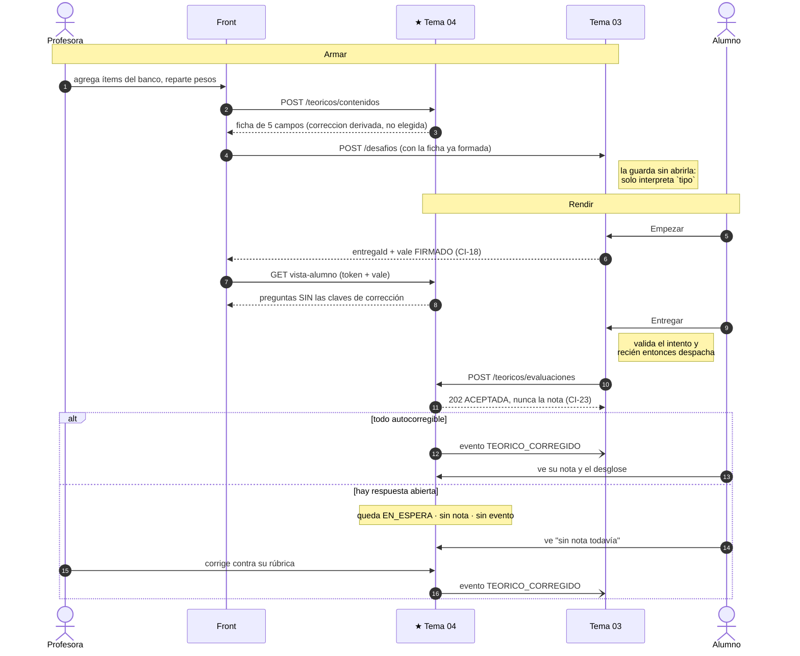

# Alfa del desafío teórico — Grupo 4

Un *vertical slice* del módulo `teoricos`: la profesora arma un cuestionario, el alumno lo
responde, el sistema lo corrige solo y le devuelve la nota con el desglose.

No es una demo decorativa. Es el camino crítico del Sprint 1 —banco → composición → lectura →
despacho → corrección— hecho antes y en chico, para que las decisiones de
`CONTRATO-INTEGRACION-G04.md` se prueben ahora y no en la semana de la entrega.

---

## Qué levanta

| Proceso | Puerto | Qué es |
|---|---|---|
| `postgres` | 5432 | Un solo esquema, `teoricos`, con los roles `app_owner` y `app_teoricos` |
| `ms-teoricos-encuestas` | 8081 | **Nuestro microservicio.** Banco de ítems, composición, lectura, corrección |
| `stub-tema-03` | 8082 | **Stub de otros grupos.** `CursoController` (Tema 02: cursos, cohortes, roadmap) y `DesafioController` (Tema 03: desafíos, intentos, entregas) |
| `front-alfa` | 4200 | Angular standalone |

**El stub es un proceso separado a propósito.** Si viviera adentro de nuestro servicio,
cualquier problema de integración se podría "resolver" inyectando un bean del otro lado, y la
demo no probaría nada. Lo único que lo une al nuestro son los dos contratos que acordamos: el
vale firmado y el mensaje de despacho.

Adentro del stub, **cada grupo tiene su controlador**: en la plataforma real, cursos y desafíos
son dos microservicios de dos equipos distintos. Comparten proceso sólo porque es un stub.

**Qué es de quién**, que es lo que la demo tiene que dejar claro:

| Concepto | Dueño |
|---|---|
| Curso y cohorte | Tema 02 |
| Roadmap y unidades | Tema 02 (RF-CUR-01/06) |
| Desafío dentro de la unidad | Tema 03 |
| El cuestionario adentro del desafío | **nosotros** |

### La frontera, dibujada

Una sola caja es nuestra, y lo único que cruza son dos mensajes: la **ficha de cinco campos**
que sale al publicar, y el **evento con la nota** que sale al terminar de corregir. Todo lo
demás —qué preguntas hay, qué contestó el alumno, cuánto sacó en cada una— se queda adentro.

```mermaid
graph LR
    subgraph nuestro["★ Tema 04 — la única caja nuestra"]
        T4["Banco de ítems versionado<br/>Composición del cuestionario<br/>Corrección y desglose"]
    end

    subgraph ajeno["De otros grupos"]
        T02["Tema 02<br/>curso · cohorte · roadmap"]
        T03["Tema 03<br/>desafío · intento · entrega"]
        T10["Tema 10<br/>XP · vidas"]
    end

    T4 == "1 · la ficha" ==> T03
    T03 == "2 · vale + entrega" ==> T4
    T4 == "3 · la nota" ==> T03

    T02 -. "cuelga de<br/>una unidad" .-> T03
    T03 --> T10

    style nuestro fill:#1f1a3a,stroke:#8b5cf6,stroke-width:3px
    style ajeno fill:#17132c,stroke:#332c55,stroke-dasharray:5 5
```



**Lo que NO hay en ese dibujo, y es lo importante:** ninguna flecha desde el Tema 03 hacia
adentro del cuestionario. Él nunca abre la ficha ni mira las respuestas: las reenvía opacas.

---

## Arrancar

```bash
cp .env.example .env
docker compose up --build
```

Verificar:

```bash
curl localhost:8081/actuator/health     # {"status":"UP"}
open http://localhost:4200
```

### El contrato, para los otros grupos

```
http://localhost:8081/swagger-ui/index.html    para leerlo y probarlo
http://localhost:8081/v3/api-docs              para generarse un cliente
```

`CONTRATO-INTEGRACION-G04.md` explica **por qué** cada decisión es como es, y es lo que hay que
leer para discutirla. El OpenAPI es la otra mitad: la **forma exacta** de cada mensaje, que un
grupo se baja y consume sin hablar con nosotros. Documenta las tres credenciales del contrato y
por qué son tres y no una: el **token** dice quién sos, el **vale** dice que el Tema 03 te
habilitó a leer esto ahora, y la **clave de despacho** dice que quien entrega es un servicio.

Dos usuarios, clave igual al usuario: **`profe`** y **`alumno`**.

**El banco viene sembrado**: al arrancar, si está vacío, se cargan 12 ítems —los seis tipos
autocorregibles más dos de respuesta abierta, ya etiquetados— con contenido real de la materia
(`SembradorDeDemo`). Es andamiaje de la demo — se apaga con
`DEMO_SEMBRAR=false` y los tests lo apagan solos. Como sólo siembra sobre un banco vacío, para
volver al estado inicial hay que borrar el volumen: `docker compose down -v`.

> **Ojo con los roles de base.** `docker/postgres/00-roles.sql` corre **solo si el volumen está
> vacío**. Si lo cambiás: `docker compose down -v` y volver a levantar. Si no, el equipo pierde
> una tarde buscando por qué el permiso nuevo no aparece.

### Sin Docker, para desarrollar

```bash
docker compose up -d postgres
cd ms-teoricos-encuestas && mvn spring-boot:run    # 8081
cd stub-tema-03         && mvn spring-boot:run     # 8082
cd front-alfa           && npx ng serve            # 4200
```

---

## El recorrido de la demo

Los siete pasos, y quién hace qué en cada uno:



1. Entrar como **profesora** → **Cursos** → *Programación IV* → el **roadmap de unidades**.
   Esa pantalla la llenan dos grupos y ninguno es el nuestro: las unidades las sirve el Tema 02
   y los desafíos el Tema 03.
2. En una unidad, **+ Crear desafío** → elegir el tipo. Se ofrecen `Teórico` y
   `Práctico · Tema 05` **deshabilitado**: la tabla de tipo → servicio la tiene el front, no el
   Tema 03 (CI-02 y CI-16).
3. **Armar el cuestionario**: agregar ítems del banco, repartir los pesos hasta 100 →
   **Publicar**. Aparece la **ficha de cinco campos**, que es literalmente todo lo que viaja al
   Tema 03, y el único campo que él interpreta es `tipo`.

   Si falta una pregunta, **+ Escribir una pregunta nueva** la escribe ahí mismo: es el mismo
   formulario del Banco montado adentro, así que la pregunta queda en el banco igual —no es una
   pregunta "del cuestionario"— y además entra a este cuestionario ya seleccionada. Un ítem
   nunca pertenece a un curso: pertenece al profesor, y es el **cuestionario** el que se cuelga
   de la unidad de un curso. Por eso el mismo ítem puede estar en dos materias a la vez.
4. Volver al roadmap: el desafío quedó **dentro de esa unidad**.
5. **Salir** → entrar como **alumno** → su curso → el mismo roadmap → **Empezar**.
   Ahí el Tema 03 crea el intento y firma el vale de lectura.
6. Responder → **Entregar**. El botón va al **Tema 03**, no a nosotros.
7. Ver la nota y el desglose por pregunta.

### El recorrido largo: la corrección humana

Si en el paso 3 agregás una **respuesta abierta**, el recorrido cambia y cuenta algo que el
corto no puede contar:

- La ficha sale con `correccion: DIFERIDA`, y **nadie la eligió**: se deriva de que hay un ítem
  que no se corrige solo (CI-07).
- El alumno entrega y **no tiene nota**. La pantalla dice *sin nota todavía*, con lo automático
  ya puntuado y lo abierto marcado como *La corrige tu profesor*.
- **El Tema 03 tampoco se enteró.** El evento `TEORICO_CORREGIDO` no salió, porque no hay nota
  que contarle.
- En la barra de la profesora aparece **Por corregir ①**, que se actualiza solo cada diez
  segundos. Si tenés las dos pestañas abiertas, el contador sube mientras mirás.
- Ella entra a la cola, lee la respuesta contra **su propia rúbrica** —que el alumno no vio
  nunca— y pone el puntaje. Recién ahí sale el evento, y recién ahí el alumno tiene nota.

Dos cosas que conviene señalar en ese momento:

- **Al alumno no se le avisa, a la profesora sí.** La asimetría es contrato: CI-37 prohíbe
  avisarle a él —se enteraría antes de que el Tema 03 aplique la penalidad por tardanza y el
  Tema 10 el XP—, y no dice nada de ella. Está escrito en la propia pantalla del alumno.
- **Un 48 sobre 60 no dice "Incorrecta", dice "Parcial".** Correcto/incorrecto es una pregunta
  que solo tiene sentido en los cuatro tipos automáticos, que son todo o nada.

Y si querés mostrar **CI-47**: al armar, tildá *reintentos ilimitados* con una abierta adentro.
El **Tema 03** rechaza el desafío con 422 —el cuestionario igual queda guardado—. La regla vive
allá y no acá porque la composición ocurre antes de que el desafío exista (CI-03), así que en
el momento de componer todavía no hay reintentos que mirar.

### El cierre, si querés mostrar lo más fino del diseño

Con el alumno en la pantalla del cuestionario, en otra pestaña como profesora: **Banco** →
**Editar** una de las preguntas → **Publicar versión nueva**. Volvés a la pestaña del alumno y
entregás. Se corrige **contra la versión que él vio**, y el desglose muestra el enunciado viejo;
el siguiente alumno que entre ya ve la nueva. Eso es CI-12, CI-13 y CI-53 en vivo — y es lo que
prueba `EstampaDeVersionIT`.

Mientras tanto, en el log de `ms-teoricos-encuestas` aparece el evento que iría a Kafka:

```
[EVENTO -> desafios.resultados | key=<desafioId>:<alumnoId>] {"eventId":…,"eventType":"TEORICO_CORREGIDO",…}
```

### El panel de demo

En la barra de la profesora hay una pantalla **Demo**, rotulada como lo que es: andamiaje, no
producto. Tiene dos cosas que hasta ahora sólo se veían desde una terminal:

- **Los eventos que salen hacia el Tema 03.** Mirá *cuándo* aparecen: con un cuestionario todo
  automático el evento sale junto con la entrega; con una respuesta abierta, el alumno entrega y
  **acá no pasa nada** hasta que la profesora pone el último puntaje. Es el contrato asincrónico,
  visible.
- **Un interruptor que apaga el Tema 03.** Apagalo y andá a armar un cuestionario: se compone y
  **se guarda igual**, y lo único que falla es la creación del desafío. Eso es CI-03 eligiendo
  cómo fallar, y el mensaje de error lo dice con todas las letras. Apaga sólo `/desafios`: los
  cursos siguen en pie, porque el Tema 02 es otro equipo y no se cae con ellos.

### Los tipos de pregunta, y por qué son estos

Ocho tipos, y **seis se corrigen solos**. Los cinco primeros venían del PRD; **respuesta corta** y
**numérica** salieron de mirar el catálogo de Moodle, que es el que la cátedra usa:

| Tipo | Cómo se corrige |
|---|---|
| Opción múltiple | Todo o nada, o ponderado por opción con negativos (CI-55) |
| Verdadero / falso, Emparejar, Ordenar | Todo o nada |
| **Respuesta corta** | Contra una lista de respuestas aceptadas, cada una con su porcentaje |
| **Numérica** | Un valor con tolerancia ±, con los bordes adentro |
| Respuesta abierta | Un humano, contra la rúbrica (D-01) |

Dos decisiones de la respuesta corta que conviene señalar en la demo:

- **La comparación es laxa por defecto** —ni mayúsculas ni acentos—, y hay dos interruptores para
  volverla estricta. Escribir «Circuit Breaker» no es un error de concepto; castigarlo convierte la
  pregunta en un dictado. La **ñ nunca se confunde con la n**: no es una vocal acentuada, es otra
  letra, y «ano» no es «año».
- **Gana la primera que coincide, no la que más paga.** Con «paris» al 100 y «parís» al 80, quien
  escriba sin tilde saca 80. Si evaluáramos todas y nos quedáramos con la mejor, ese 80 no se
  aplicaría nunca y el profesor no tendría forma de castigar una variante.

Y un 36 sobre 60 en una respuesta corta dice **Parcial**, no «Incorrecta», por la misma razón que
el puntaje parcial por opción.

**Lo que del catálogo de Moodle NO entra, y por qué:**

| Tipo | Por qué no |
|---|---|
| Arrastrar y soltar (×3) | Necesitan subir imágenes, y no hay almacenamiento de archivos |
| Calculada (×3), Emparejamiento aleatorio | Cada alumno vería números o pares distintos, y guardarlos al servirlos rompe **CI-19**: la lectura no escribe. Se podría con el mismo truco del barajado —semilla `SHA-256(contenidoId + alumnoId)`— pero eso ya es diseño nuevo |
| Respuestas anidadas (Cloze) | Es un mini-lenguaje de marcado propio; es un proyecto en sí mismo |

### Las etiquetas del banco

Un ítem **no pertenece a ningún curso**, y ese es el punto: `item` tiene `profesor_id` y no
`curso_id`. El que se cuelga de la unidad de un curso es el **cuestionario**, y por eso la misma
pregunta puede entrar en dos materias y un cuestionario se puede reutilizar en otra cohorte.

Lo que sí hace falta con un banco grande es encontrar la pregunta, y para eso están las etiquetas:
libres, varias por ítem, con autocompletado de las que el profesor ya usó y filtro por etiqueta en
el Banco y al armar. Moodle resuelve esto con **Categoría**, que es una sola por pregunta; elegimos
varias porque una sola obliga a decidir hoy cuál es el eje —¿la unidad? ¿el tema? ¿la dificultad?—
y el profesor descubre a mitad del cuatrimestre que necesitaba otro.

Tres detalles que se notan al usarlas:

- **Se normalizan**: minúsculas y sin acentos. Sin eso, «Microservicios», «microservicios» y
  «MICROSERVICIOS» son tres etiquetas y el filtro deja de servir justo cuando el banco crece.
- **Cuelgan del ítem, no de la versión** (igual que `estado`, ver `V7`): reetiquetar no publica una
  versión nueva, porque el contenido de la pregunta no cambió.
- **No mandar el campo no es lo mismo que mandarlo vacío**: ausente deja las que el ítem ya tiene
  —así un cliente viejo no las borra sin querer— y vacío las saca todas.

### Mis entregas, y reutilizar un cuestionario

Dos cosas más que hacen visible lo que el modelo ya garantizaba:

- **El alumno tiene una pantalla con todas sus entregas.** CI-44 dice que se guarda una
  corrección por entrega y **nunca se pisa**; hasta ahora nadie podía verlo. Si rindió dos veces
  el mismo desafío y la profesora editó un ítem en el medio, ahí se ven los dos intentos, cada
  uno corregido contra la versión que él vio.
- **Un cuestionario ya armado se puede colgar de otra unidad o de otra cohorte.** Al armar, si el
  profesor ya tiene cuestionarios, aparecen arriba para reutilizar. Los dos desafíos apuntan al
  **mismo `contenidoId`**: la ficha es una referencia, no una copia, así que editar una pregunta
  los cambia a los dos — y cada alumno se sigue corrigiendo contra la versión que vio.

  Ojo con lo que esa pantalla **no** muestra: cuántos desafíos usan cada cuestionario. No podemos
  saberlo. Los desafíos viven en el Tema 03, y contarlos sería una llamada sincrónica a otro
  grupo cada vez que el profesor abre la lista.

### Tres cosas para mirar en la demo

- **El alumno ve la nota, no si aprobó.** No es un olvido: el PRD no define en ningún lado el
  umbral de aprobación (H-16), y como el umbral maneja XP y vidas, es economía. La decide el
  Tema 03 (CI-39).
- **La ficha tiene cinco campos y ni uno más.** Cada campo de más sería conocimiento de
  contenido filtrándose al Tema 03.
- **Editar un ítem no cambia lo ya corregido, pero sí lo que ve el próximo alumno.** No hay
  congelamiento: hay estampa (CI-12, CI-13). El test `EstampaDeVersionIT` es el que lo prueba.
- **Cada alumno ve las preguntas en otro orden, y el orden no se guarda en ningún lado.** Sale de
  `SHA-256(contenidoId + alumnoId)`, así que es estable entre recargas y se puede reconstruir al
  armar el desglose —por eso el resultado le dice "pregunta 3" a la que para él era la 3—. Es lo
  que permite tener barajado sin romper CI-19: la lectura sigue sin escribir nada. **Es producto
  fuera del PRD**, decidido a sabiendas; está anotado en CI-19.

---

## Tests

```bash
cd ms-teoricos-encuestas
mvn verify
```

129 tests: 79 de dominio puro (corrección de los seis tipos, validaciones de payload) y 50 de
integración contra PostgreSQL real, conectándose con los **roles reales** y no con el
superusuario — si falta un permiso, queremos que falle en el build y no en la demo.

Los que valen la pena leer:

| Test | Qué prueba |
|---|---|
| `EstampaDeVersionIT` | **El que justifica todo el modelo.** El profesor edita mientras el alumno contesta |
| `VistaAlumnoSinCriterioIT` | Que ninguna clave de corrección aparezca en el **JSON crudo** del alumno |
| `ValeInvalidoRechazadoIT` | Sin vale, con la firma cambiada, vencido, y de otro cuestionario |
| `ComposicionYDespachoIT` | Pesos, idempotencia del despacho, y que el acuse nunca lleve la nota |
| `BancoAjenoNoSeVeIT` | El banco de cada profesor es invisible para el resto |
| `CorreccionHumanaIT` | **El que prueba que el contrato con el 03 siempre fue asincrónico.** El evento no sale hasta que el profesor pone el último puntaje |
| `BarajadoPorAlumnoIT` | Dos alumnos ven otro orden, el mismo alumno ve siempre el suyo, y el desglose sale como él las vio |
| `RespuestaCortaYNumericaTest` | Que la comparación sea laxa por defecto, que gane la primera aceptada y no la que más paga, y que los bordes de la tolerancia entren |
| `EtiquetasDelBancoIT` | Que la etiqueta no sea una puerta al banco ajeno, y que reetiquetar no invente historial |

### Si los tests no arrancan

Dos cosas de entorno rompían la suite entera en Windows, y las dos están arregladas en el
`argLine` del `pom.xml`. Se documentan porque el síntoma de la primera es engañoso y hace
perder una tarde:

| Síntoma | Causa real |
|---|---|
| `Could not find a valid Docker environment`, con el CLI de Docker funcionando al lado | Testcontainers 1.20.4 negocia una versión de API que Docker Engine 29 ya no acepta. Se fija con `-Dapi.version=1.44` |
| `FATAL: invalid value for parameter "TimeZone"` | La JVM resuelve la zona local a `America/Buenos_Aires`, que no existe en IANA. Los tests corren en UTC, igual que el contenedor en producción |

Si aparece el primer mensaje otra vez después de actualizar Docker, el número de `api.version`
quedó viejo: subir Testcontainers es el arreglo de fondo y deja ese flag de sobra.

Queda además una salida para una máquina sin Docker: correr los tests contra una base ya
levantada.

```bash
docker compose up -d postgres
ALFA_DB_URL=jdbc:postgresql://localhost:5432/g04_test mvn verify
```

`g04_test` la crea `docker/postgres/00-roles.sql` al inicializar el volumen.

---

## Lo que la alfa NO tiene

Está afuera a propósito, y conviene decirlo antes de que alguien lo busque:

- **El módulo `encuestas` entero**, con sus tres esquemas, sus tres roles y el test de
  reconstrucción de los cinco canales (`G04-HU06`, `G04-HU08`). Es la parte más importante del
  sprint y no arrancó.
- **Kafka.** El evento se publica contra el puerto `PublicadorDeEventos` con un adaptador en
  memoria que escribe el envelope en el log. El adaptador de Kafka entra sin tocar quién publica.
- **La corrección por LLM**, la apelación (CI-35) y el recálculo (CI-50). Las respuestas
  abiertas y la cola de corrección del profesor SÍ están: ver el recorrido largo.
- **Eureka y el gateway.** Los tres procesos se hablan por URL directa.
- **i18n** (`G04-HU04`): los textos de error viven en `ClaveError`, con la clave ya separada del
  mensaje, pero todavía no salen de un `messages_*.properties`.
- **Anonimización** (D-11).

**CI-47** ya rechaza de verdad, y terminó en un lugar distinto del que decía el plan: no en
`ComposicionService` sino en el **Tema 03**, que es quien conoce los reintentos. El `TODO` que
estaba de nuestro lado era una conclusión equivocada, y el comentario que quedó en su lugar
explica por qué.

---

## El mapa de los doce temas

Quién es dueño de qué en la plataforma, con cuáles de los otros once nos hablamos de verdad y con
cuáles no nos cruzamos nunca:

**https://claude.ai/code/artifact/8aaa62bf-5735-44b6-9043-8b198c53b221**

Incluye la zona gris que conviene tener a mano en la defensa: la propuesta de arquitectura le da
el grafo de contenidos al Tema 10 y el PRD mete el roadmap adentro de Cursos, que es del Tema 02.
Los dos documentos de la cátedra no dicen lo mismo, y nosotros elegimos un lado.

---

## Dónde está cada cosa

```
alfa/
├── ms-teoricos-encuestas/          nuestro microservicio
│   └── src/main/java/…/
│       ├── comun/                  config, errores, identidad, eventos
│       └── teoricos/
│           ├── dominio/            TipoDeItem, payloads sellados, correctores
│           ├── aplicacion/         banco, composición, evaluación, vale, cola de corrección
│           └── infraestructura/    JPA y controladores
├── stub-tema-03/                   ~200 líneas, todo en memoria
├── front-alfa/                     Angular standalone
└── docker/postgres/00-roles.sql    los roles, fuera de Flyway
```

La regla que sostiene el diseño y que hay que respetar al agregar código: `teoricos` y
`encuestas` no se importan entre sí, y cada repositorio está atado a **un solo** origen de
datos. Hoy lo sostiene la convención; a partir de `G04-HU02` lo verifica ArchUnit.
